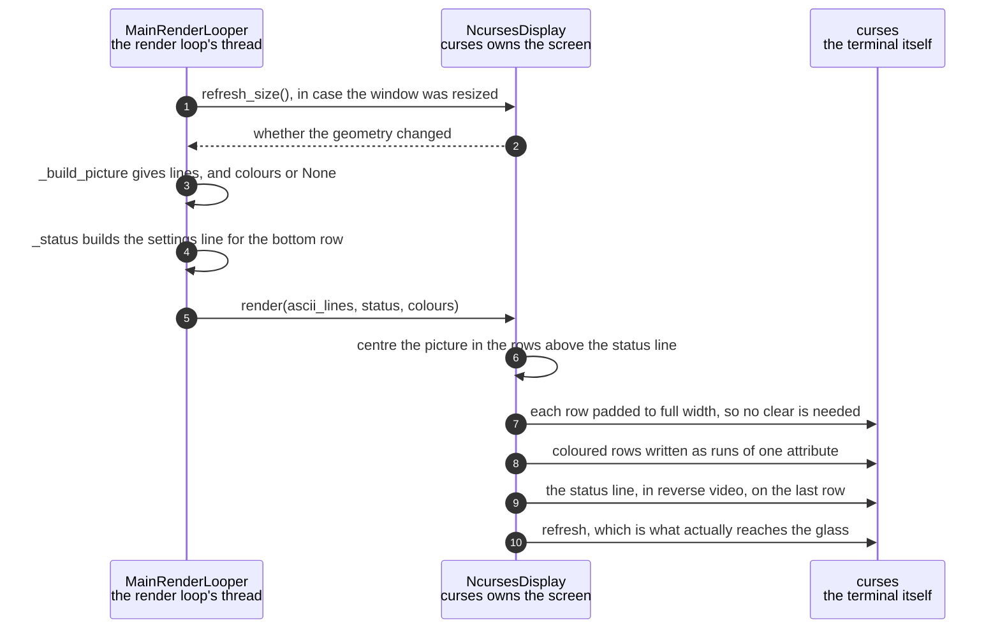

# The character grid is drawn on the HDMI terminal

**Priority: `MEDIUM`** — it runs on every frame, but only in a configuration the appliance never boots into: the enclosure starts with `--no-terminal`. [What the priorities mean](../how-to-write-scenario-docs.md).

A grid of characters becomes a picture on a monitor. The value is a live view
you can sit in front of with a keyboard, which is what the app is on a desk
rather than in a box — and the reason it is only `MEDIUM` is that the deployed
service passes `--no-terminal` and this code never runs there.

Two things make it more than a print loop. The picture is **centred** in a
window that rarely fits it exactly, and every row is padded out to the full
width so the previous frame's characters are overwritten without a `clear()`.
Clearing and redrawing would flash; padding is the same number of writes and
does not.

The other is colour. A row of 267 characters written one at a time would be 267
calls into curses; instead a coloured row is drawn as **runs** of equal colour,
and a greyscale row as a single string, because greyscale passes `None` rather
than a uniform array. That `None` is not an absent value — it is the cheapest
instruction available, meaning "use the terminal's own foreground".

The constraint that shapes everything around this class is that **curses owns
the terminal**. Anything written to standard output or standard error while it
holds the screen corrupts the picture until the next full repaint, which is why
the app redirects both to a log file before it starts.

| Class | What it represents, and its part in this scenario |
|---|---|
| [`MainRenderLooper`](../../ascii_camera.py#L98) | The one object the process is hung off. Here it is the **supplier**: it builds the lines and the colours, decides the status line, and hands all three over — it never positions anything on the screen itself |
| [`NcursesDisplay`](../../src/hdmi/ncurses_display.py#L34) | The HDMI terminal, and the owner of the screen while curses holds it. Here it is the **compositor**: [`render`](../../src/hdmi/ncurses_display.py#L185) centres the picture, pads every row, and writes colour as runs rather than per character |

## One frame onto the terminal

| Step | Message | What is going on |
|---:|---|---|
| 1 | [`refresh_size`](../../src/hdmi/ncurses_display.py#L167)`()`, in case the window was resized | Asked every frame rather than waited for as an event, because a resize arrives as a keypress and the two would race. A `RESIZE` key also arrives and clears the cached grid, so the two paths agree |
| 2 | whether the geometry changed | True invalidates the cached grid, and the picture is refitted on the next pass. The panel's grid is untouched by any of this, which is what lets the window be dragged about without the panel changing |
| 3 | [`_build_picture`](../../ascii_camera.py#L737) gives lines, and colours or None | `None` for greyscale is the cheap path, not a missing value. In `--no-terminal` this step builds nothing at all, and the saving is the entire point of that flag |
| 4 | [`_status`](../../ascii_camera.py#L570) builds the settings line for the bottom row | Every live setting and the key that changes it, trimmed to what fits. It is a function of its arguments, so it can be tested without a terminal |
| 5 | [`render`](../../src/hdmi/ncurses_display.py#L185)`(ascii_lines, status, colours)` | Everything the display needs, in one call. The looper never addresses a cell: where the picture sits is the display's business, which is what lets the headless stand-in accept the identical call and do nothing |
| 6 | centre the picture in the rows above the status line | The window is almost never exactly the grid's shape, so the remainder is split above and below. The status line is reserved first, which is why the canvas is one row short |
| 7 | each row padded to full width, so no clear is needed | The alternative is `clear()` then redraw, which flashes. Padding costs the same writes and leaves nothing of the previous frame behind. `fill` is the exception that forces a real clear, because letterboxing leaves cells the picture stops writing to |
| 8 | coloured rows written as runs of one attribute | Adjacent cells of equal colour are written together. Per character, a 267-column row would be 267 calls into curses every frame |
| 9 | the status line, in reverse video, on the last row | Written inside a `try` that swallows the error curses raises on the final cell of a row — the character lands regardless, and the alternative is a crash on a full-width write |
| 10 | refresh, which is what actually reaches the glass | Everything before this only edits an in-memory window. One refresh per frame is what makes the picture appear at once rather than in pieces |

No thread bands: all of it is the render loop's own thread, and that is not
incidental. curses is not safe to drive from two threads, and the app's answer
is to have only one that ever touches it — which is also why anything slow
lives on some other thread entirely.

## Related scenarios

- [Pixel brightness is mapped to ramp characters](pixel-brightness-is-mapped-to-ramp-characters.md)
  — where the lines handed to `render` come from.
- [A colour scheme is compiled into a per-cell lookup table](a-colour-scheme-is-compiled-into-a-per-cell-lookup-table.md)
  — where the palette indices come from, and why the terminal can only take
  indices.
- [A frame reaches the SPI panel without stalling the render loop](a-frame-reaches-the-spi-panel-without-stalling-the-render-loop.md)
  — the other display, drawn on its own thread from the same frame.
- [A keypress updates the render configuration](a-keypress-updates-the-render-configuration.md)
  — the keyboard this display reads, and where those keys go.
