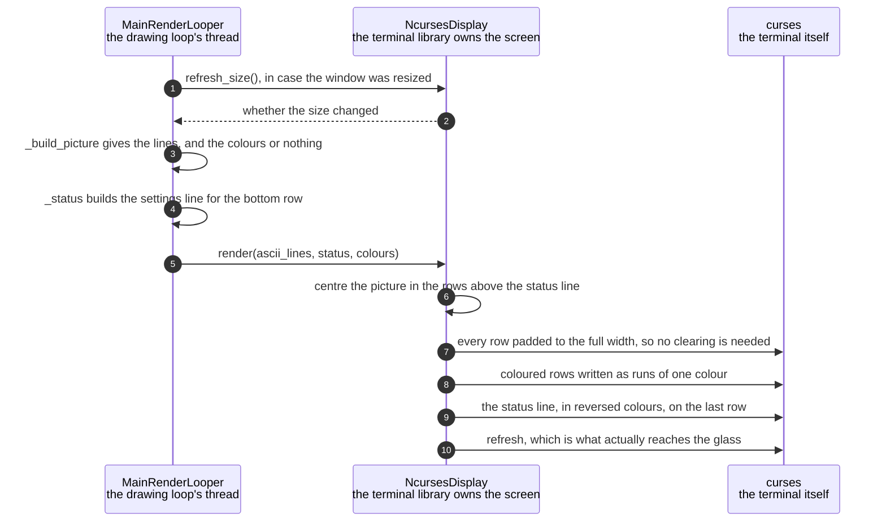

# The character grid is drawn on the HDMI terminal

**Priority: `MEDIUM`** — it runs on every picture, but only in an arrangement the sealed box never starts up in, because that box is launched with `--no-terminal`[^headless]. [What the priorities mean](../how-to-write-scenario-docs.md).

A grid[^grid] of characters becomes a picture on an ordinary monitor.

The value is a live view somebody can sit in front of with a keyboard, which is
what this program is when it lives on a desk rather than inside a sealed box.
The reason this scenario rates only as medium importance is that the version
which runs automatically on the box passes `--no-terminal`, so none of this code
runs there at all.

Two things make it more than a simple loop that prints lines.

The first is that the picture has to be **centred**, because the window is
almost never exactly the shape of the grid, and every row has to be **padded out
to the full width of the window**. Padding is what overwrites the previous
picture's characters. The obvious alternative is to clear the screen and redraw
it, but clearing makes the whole window flash. Padding costs exactly the same
number of writes and does not flash, so it is simply better.

The second is colour. A row 267 characters wide, written one character at a
time, would mean 267 separate requests to the terminal library[^ncurses] for
every single picture. Instead a coloured row is written as **runs**: neighbouring
cells that share a colour are written together in one request. A grey row is
cheaper still and is written as a single string, because drawing in grey passes
nothing at all rather than passing an array in which every entry is the same.
That "nothing" is not a missing value. It is the cheapest instruction available,
and it means "use whatever colour the terminal normally writes in".

The constraint shaping everything around this class is that **the terminal
library owns the screen**. Anything written to ordinary output while it holds
the screen corrupts the picture until the next complete repaint. That is why the
program redirects both its ordinary output and its error output into a log file
before it starts.

*The window is almost never the same shape as the grid, and everything this
class does about that is in the drawing: centre the picture, pad the rows, and
keep the last row back for the status line. The amber line is the part worth
looking at. Every row is written out to the full width of the window, so the
previous picture is overwritten rather than cleared away. That costs the same
number of writes and does not flash.*

Kept by hand: edit [`terminal-layout.svg`](../images/terminal-layout.svg)
directly, since nothing regenerates it.

| Class | What it represents, and its part in this scenario |
|---|---|
| [`MainRenderLooper`](../../ascii_camera.py#L99) | The single object the whole running program hangs from. In this scenario it is the **supplier**. It builds the lines of text and the colours, decides what the status line[^statusline] should say, and hands all three over. It never positions anything on the screen itself |
| [`NcursesDisplay`](../../src/hdmi/ncurses_display.py#L34) | An ordinary monitor connected by an HDMI cable, and the owner of the screen for as long as the terminal library holds it. In this scenario it is the **arranger**. [`render`](../../src/hdmi/ncurses_display.py#L185) centres the picture, pads every row out to the full width, and writes colour as runs rather than one character at a time |

## One picture onto the monitor

```mermaid
sequenceDiagram
    autonumber
    participant App as MainRenderLooper<br/>the drawing loop's thread
    participant Term as NcursesDisplay<br/>the terminal library owns the screen
    participant Curses as curses<br/>the terminal itself

    App->>Term: refresh_size(), in case the window was resized
    Term-->>App: whether the size changed
    App->>App: _build_picture gives the lines, and the colours or nothing
    App->>App: _status builds the settings line for the bottom row
    App->>Term: render(ascii_lines, status, colours)
    Term->>Term: centre the picture in the rows above the status line
    Term->>Curses: every row padded to the full width, so no clearing is needed
    Term->>Curses: coloured rows written as runs of one colour
    Term->>Curses: the status line, in reversed colours, on the last row
    Term->>Curses: refresh, which is what actually reaches the glass
```

| Step | Message | What is going on |
|---:|---|---|
| 1 | [`refresh_size`](../../src/hdmi/ncurses_display.py#L167)`()`, in case the window was resized | The size is asked for every picture rather than waited for as an announcement, because a resize arrives disguised as a key press and the two would otherwise collide. A `RESIZE` key also arrives and throws away the remembered grid size, so both paths reach the same conclusion |
| 2 | whether the size changed | A change throws away the remembered grid size, and the picture is fitted again on the following pass. The small panel[^panel]'s grid is completely untouched by any of this, which is what allows the window to be dragged about freely without the panel changing at all |
| 3 | [`_build_picture`](../../ascii_camera.py#L738) gives the lines, and the colours or nothing | Passing nothing for a grey picture is the cheap path rather than a missing value. When the program runs with no monitor, this step builds nothing whatsoever, and that saving is the entire purpose of that option |
| 4 | [`_status`](../../ascii_camera.py#L571) builds the settings line for the bottom row | Every current setting together with the key that changes it, trimmed down to whatever fits across the window. It is worked out purely from the values handed to it, which means it can be tested without any terminal being involved |
| 5 | [`render`](../../src/hdmi/ncurses_display.py#L185)`(ascii_lines, status, colours)` | Everything the display needs, in a single call. The drawing loop never refers to an individual cell. Where the picture sits is the display's own business, and that is exactly what lets the do-nothing stand-in used with `--no-terminal` accept the identical call and simply ignore it |
| 6 | centre the picture in the rows above the status line | The window is almost never exactly the grid's shape, so the leftover rows are divided between the top and the bottom. The status line is set aside first, which is why the area available for the picture is one row shorter than the window |
| 7 | every row padded to the full width, so no clearing is needed | The alternative is to clear the screen and then redraw it, which makes the window flash. Padding costs the same number of writes and leaves nothing of the previous picture behind. Choosing `fill`[^fill] is the exception that forces a genuine clear, because fitting a picture inside a differently shaped window leaves cells around the edge that the picture stops writing to |
| 8 | coloured rows written as runs of one colour | Neighbouring cells sharing a colour are written together in one request. Written one character at a time, a row 267 columns wide would mean 267 requests to the terminal library for every picture drawn |
| 9 | the status line, in reversed colours, on the last row | Written inside a guard that quietly ignores the complaint the terminal library makes about the very last cell of a row. The character is placed regardless, and the alternative would be the program stopping whenever a line reached the full width of the window |
| 10 | refresh, which is what actually reaches the glass | Everything before this only alters a copy of the window held in memory. Doing exactly one refresh for each picture is what makes the whole picture appear at once rather than arriving in visible pieces |

## Why this display has no thread of its own

The small panel is drawn on a thread of its own. It is reasonable to ask why the
monitor is not, and the answer explains why the two are treated differently
rather than inconsistently.

**The panel's thread works because the panel's cost is waiting rather than
working.** Sending a picture down the wire to the panel takes about 33
milliseconds, and during that time the operating system is moving the bytes.
Python is doing nothing. Python has a rule, called the global interpreter lock,
that stops two threads running Python instructions at the same moment, but that
rule is lifted while a thread is waiting on something outside Python. So the
panel's thread genuinely runs alongside the drawing loop instead of taking turns
with it. That was measured rather than assumed, by
`tests/lcd/lcd_concurrency.py`, which exists precisely to rule out the
possibility that the lock is held and the thread is achieving nothing.

**The monitor has no such waiting to hide.** Its cost is a loop over the rows of
the window, making requests to the terminal library, plus the arithmetic that
built the lines beforehand. Both of those are Python doing work, and Python
doing work holds the lock. Moving them to a separate thread would make the two
threads take turns rather than run together. The total amount of work would be
identical, and the program would have gained a queue and a co-ordination problem
in exchange for nothing at all.

Three further reasons support the same conclusion.

The terminal library **cannot safely be driven from two threads**, and this
display object is already being used from the drawing loop's thread for other
purposes: reading keys, noticing that the window was resized, and being told
about a settings change. A drawing thread would put a boundary through the
middle of all of that.

There is also **very little left to hand over**. The panel is given a camera
picture and does its own shrinking and character-choosing, which is real work
moved off the loop. The monitor is given lines of text that are already
finished, because the loop did the expensive part before calling. Handing off
the final writing would move almost nothing.

Finally, there is **no blocking here to protect the loop from**. The panel's
thread exists so that the loop is never stopped for 33 milliseconds. A monitor
thread would not make the loop any faster, because the loop still has to build
the lines whether or not somebody else writes them out.

So the two displays are not treated differently by accident. **The panel was
given a thread because its cost is waiting on hardware, and waiting overlaps.
The monitor's cost is calculation, and calculation does not.**

There are no coloured thread bands in the diagram above, and that is the same
point seen from the other side. Every message in it happens on the drawing
loop's own thread.

## Related scenarios

- [Pixel brightness is mapped to ramp characters](pixel-brightness-is-mapped-to-ramp-characters.md)
  — where the lines of text handed over for drawing actually come from.
- [A colour scheme is compiled into a per-cell lookup table](a-colour-scheme-is-compiled-into-a-per-cell-lookup-table.md)
  — where the colour numbers come from, and why a monitor can only accept
  numbers rather than colours.
- [A frame reaches the SPI panel without stalling the render loop](a-frame-reaches-the-spi-panel-without-stalling-the-render-loop.md)
  — the other screen, drawn on its own thread from the very same camera
  picture, and the scenario that explains the waiting described above.
- [A keypress updates the render configuration](a-keypress-updates-the-render-configuration.md)
  — the keyboard this display reads, and where those key presses go afterwards.

### Footnotes

[^headless]: The option `--no-terminal` runs the program with no monitor
    picture at all. A stand-in object is used, offering all the same methods as
    a real display but doing nothing when they are called. The sealed box starts
    up that way, because there is no monitor attached to it, so the cost of
    building a monitor picture is not so much wasted as never paid in the first
    place.

[^grid]: The **character grid** is how this program holds a picture: as a
    rectangle of character cells rather than of dots. Each cell is one
    character, chosen according to how bright the patch of camera picture behind
    it happens to be. [`to_grid`](../../src/capture/image_processor.py#L172) is
    the code that reduces a picture to that grid. How many cells there are
    depends on where the picture is being sent — 64 across and 24 down on the
    small attached panel at the usual text size, and whatever fits the window
    when the picture goes to an ordinary monitor instead.

[^ncurses]: **curses** is a library for drawing at chosen positions within a
    terminal, rather than simply printing lines one after another. **ncurses**
    is the version of it that Linux provides, and
    [`NcursesDisplay`](../../src/hdmi/ncurses_display.py#L34) is the code that
    wraps it here. It is what makes an ordinary terminal controllable enough to
    hold a picture that changes fifteen times a second.

[^statusline]: The **status line** is the single line of readings underneath the
    picture, showing the colour scheme, the ramp, how many pictures a second are
    being drawn, and the size of the grid. It is built by
    [`status_line`](../../src/hdmi/status_line.py#L76). It is also where a
    refusal or a short message appears when the program is running on an
    ordinary monitor, because there is nowhere else on a monitor to put one.

[^panel]: The **SPI panel** is a small screen measuring 2.4 inches across the
    diagonal, 240 dots by 320, using a controller chip called the ILI9341. It is
    connected to the computer by a simple four-wire arrangement called SPI, which
    is a common way of attaching small devices. It is driven entirely by the
    program itself, through [`ILI9341`](../../src/lcd/lcd.py#L47), with no
    separate system driver involved. In the sealed box this program is built
    for, this panel is the only screen there is. One complete picture for it is
    153,600 bytes, which has to be sent in pieces of 4 kilobytes each — see
    [`SPI_CHUNK`](../../src/lcd/lcd.py#L44) — because that is as much as the
    connection will accept at a time.

[^fill]: **fill** and **fit** are the two ways of placing a picture into a space
    that is not the same shape as the picture. The camera picture is four units
    wide for every three units tall. Choosing `fit` keeps the whole picture and
    shrinks the grid until it matches that shape, which leaves empty cells
    around the picture. Choosing `fill` makes the grid occupy the whole space
    and trims the picture to suit, so no cell is wasted but the edges of the
    picture are lost. It is one of only two settings that change the shape of
    the grid rather than merely its appearance.
