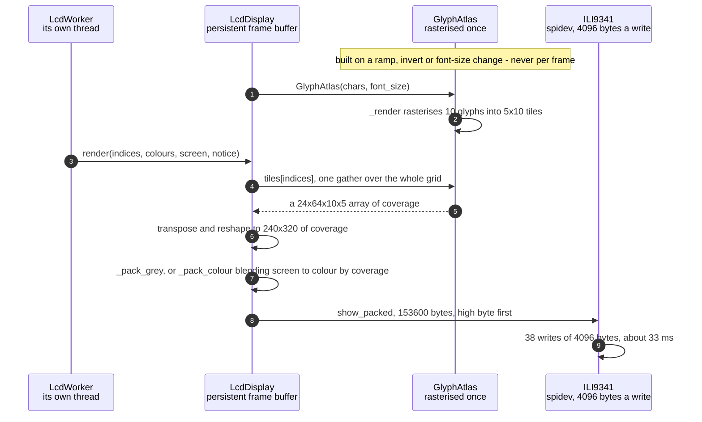

# The character grid is packed into RGB565 pixels for the ILI9341

**Priority: `HIGH`** — every frame the panel[^panel] shows is built here, and in the enclosure the panel is the only output there is. [What the priorities mean](../how-to-write-scenario-docs.md).

A 64x24 grid[^grid] of ramp[^ramp] positions has to become 153,600 bytes in
the panel's own byte order, fifteen times a second, on a machine with one slow
core. The value is that it costs about **3.7 ms of CPU** — 1.2 for the glyphs
and 2.4 for the packing — against 33 ms of SPI transfer for the same frame.
The drawing is not what is expensive here, and that is the result of two
decisions rather than an accident.

The first is that glyphs are **never drawn per cell**. A `draw.text` call per
character at 64x24 would be 1,536 PIL[^pil] calls a frame; instead every
character of the ramp is rasterised[^coverage] once into a fixed-size tile
when the atlas[^atlas] is built, and a frame is one numpy gather from that
tile array. At font size 8 the cells are 5x10 pixels and ten of them tile
320x240 exactly at 64x24 — which is also why that font size is the default.

The second is that the packing never materialises a three-channel image.
RGB565[^rgb565] puts red and blue in five bits and green in six, high byte
first, and the shifts that produce it can be done straight from the coverage
image in greyscale[^scheme], where red, green and blue are all the same
number. Grey 200 becomes `0xce 0x59`, which is r=25, g=50, b=25 in the panel's
own scale.

Colour is where it gets interesting, because the coverage is not a mask but a
**fade**. A pixel the glyph misses entirely comes out as the scheme's unlit
screen colour, one the glyph fully covers as the cell's own colour, and the
antialiased edge lands in between. That is one blend per pixel over 76,800
pixels, so the black-screen case — which is greyscale and the live scheme, and
therefore most of the time — is special-cased into a plain modulate that stays
in `uint16` and skips an `int32` promotion. It is worth about 7 ms a frame.

*Every stage but the last is a rearrangement rather than a calculation, which is
the reason the drawing costs 3.7 ms against 33 ms of transfer. The four-part
shape in the middle is the one worth looking at twice: a cell's ten pixel rows
sit together as gathered, and `transpose(0, 2, 1, 3)` is what puts them where a
picture's rows are. The bit strip is the worked example this document quotes —
coverage 200 becoming `0xCE 0x59`.*

Kept by hand: edit
[`rgb565-packing.svg`](../images/rgb565-packing.svg) directly, since nothing
regenerates it.

| Class | What it represents, and its part in this scenario |
|---|---|
| [`GlyphAtlas`](../../src/lcd/lcd_display.py#L46) | Every character of a ramp, pre-rendered into a fixed-size cell. Here it is the **type case**: [`_render`](../../src/lcd/lcd_display.py#L69) rasterises each glyph exactly once, and warns about any the font lacks rather than letting them come out blank |
| [`LcdDisplay`](../../src/lcd/lcd_display.py#L98) | An ASCII grid turned into pixels. Here it is the **compositor**: [`_blit`](../../src/lcd/lcd_display.py#L339) is one gather and a reshape, and [`_pack_colour`](../../src/lcd/lcd_display.py#L360) turns coverage into a blend rather than a stencil |
| [`ILI9341`](../../src/lcd/lcd.py#L47) | The panel over spidev[^spidev]. Here it is the **byte sink**, and it dictates the format: [`show_packed`](../../src/lcd/lcd.py#L186) takes bytes already in the panel's layout and checks the length against the panel's own geometry rather than trusting it |

## One grid of indices, one frame of RGB565

| Step | Message | What is going on |
|---:|---|---|
| 1 | [`GlyphAtlas`](../../src/lcd/lcd_display.py#L46)`(chars, font_size)` | The characters arrive **already inverted** if that was asked for, so the atlas holds the ramp in the order it will be indexed. That is what lets the position table stay untouched by `invert`[^invert] while both displays still choose the same glyph |
| 2 | [`_render`](../../src/lcd/lcd_display.py#L69) rasterises 10 glyphs into 5x10 tiles | Cell width from the advance of `M` — monospace, so any character is a witness — and height from the font's ascent plus descent. A glyph the font lacks would come out blank or as a `.notdef` box, so a missing one is warned about by name rather than left to look like a broken picture |
| 3 | [`render`](../../src/lcd/lcd_display.py#L299)`(indices, colours, screen, notice)` | `screen` is the scheme's unlit colour and is not decoration: every pixel no glyph covers becomes it. `colours` being `None` is not a missing argument but the cheapest instruction available — draw white on black |
| 4 | tiles[indices], one gather over the whole grid | The whole point. 1,536 cells are indexed in a single numpy operation rather than 1,536 PIL calls, and the tiles were rasterised once when the atlas was built rather than once per frame |
| 5 | a 24x64x10x5 array of coverage | Four-dimensional and in the wrong order: cell rows and pixel rows are interleaved the wrong way for a picture. Nothing has been copied yet |
| 6 | transpose and reshape to 240x320 of coverage | `transpose(0, 2, 1, 3)` puts the cell's pixel rows inside the picture's rows, and the reshape flattens it into an image. Coverage is 0 to 255 per pixel — the `@` glyph peaks at 239 rather than 255, because the rasteriser antialiases |
| 7 | [`_pack_grey`](../../src/lcd/lcd_display.py#L353), or [`_pack_colour`](../../src/lcd/lcd_display.py#L360) blending screen to colour by coverage | Greyscale packs straight from the single coverage channel, since red, green and blue are all the same number and the bit twiddling collapses — a three-channel image is never built. Colour repeats one colour per cell up to one per pixel and blends. The black-screen case is special-cased to a modulate that stays in `uint16`, worth about 7 ms a frame, and the general case uses `(coverage + 1) >> 8` rather than a divide by 255: exact at both ends, and it saves a division over 76,800 pixels |
| 8 | [`show_packed`](../../src/lcd/lcd.py#L186), 153600 bytes, high byte first | Already in the panel's layout, so this path skips the PIL round trip and the conversion `show` would do. The length is checked against the panel's own width and height — a buffer of the wrong size would otherwise be written as a window's worth of garbage |
| 9 | 38 writes of 4096 bytes, about 33 ms | `/sys/module/spidev/parameters/bufsiz` is 4,096, so a frame cannot go in one call. The transfer dominates: against it the 3.7 ms of drawing is noise, which is why effort went into not drawing per cell rather than into the clock rate |

No thread bands: every message here is on the LCD worker[^lcd]'s thread. That
the worker exists at all is what makes 33 ms of transfer affordable, and it is
drawn in its own scenario rather than repeated here.

The frame buffer is **persistent** between calls, which matters twice. It is
what lets a notice[^notice] be painted over a picture that is not being
redrawn, and it is the trap that `_rebuild` and `clear_notice` both have to
guard: a larger font gives a *smaller* picture, and nothing ever writes to the
margin it no longer reaches, so the buffer must be zeroed rather than left.

## Related scenarios

- [A frame reaches the SPI panel without stalling the render loop](a-frame-reaches-the-spi-panel-without-stalling-the-render-loop.md)
  — the thread all of this runs on, and how the frame got to it.
- [Pixel brightness is mapped to ramp characters](pixel-brightness-is-mapped-to-ramp-characters.md)
  — where the indices come from, and why the panel wants positions rather than
  characters.
- [A camera that stopped delivering frames is detected and announced](a-camera-that-stopped-delivering-frames-is-detected-and-announced.md)
  — what the persistent frame buffer is for when there is no picture to draw.
- [A colour scheme is compiled into a per-cell lookup table](a-colour-scheme-is-compiled-into-a-per-cell-lookup-table.md) — where the
  `colours` argument comes from in a tinted scheme.

### Footnotes

[^panel]: The **SPI panel** is a 2.4 inch ILI9341 LCD, 240x320, wired to the
    Pi's SPI bus — a four-wire serial bus for talking to peripherals — and
    driven from userspace by [`ILI9341`](../../src/lcd/lcd.py#L47) with no
    kernel driver behind it. In the sealed enclosure it is the only display
    there is. One full frame is 153,600 bytes, sent in
    [`SPI_CHUNK`](../../src/lcd/lcd.py#L44) pieces of 4 KB because that is what
    the driver's buffer holds.

[^grid]: The **character grid** is the picture as this app holds it: `rows` by
    `cols` character **cells** rather than pixels, each cell one character
    chosen from the brightness of the patch of camera frame it covers.
    [`to_grid`](../../src/capture/image_processor.py#L172) is what resizes a
    plane to it. How big it is depends on where the picture is going — 64 by 24
    on the SPI panel at the default font size, and whatever the window holds on
    the HDMI terminal.

[^ramp]: A **ramp** is the string of characters the picture is drawn with,
    ordered from lightest to darkest — ` .:-=+*#%@` is one. Brightness picks a
    position along it, so the ramp is what decides how the picture looks before
    any colour is involved. The named ones are in
    [`RAMPS`](../../src/art/ascii_art.py#L17) and the setting chooses between
    them.

[^pil]: The Python Imaging Library, as maintained in Pillow. It is what
    rasterises the glyphs and what the panel's slower path uses to convert an
    image. Its per-call cost is the thing this app organises itself to avoid:
    one call that does a whole frame is fine, 1,536 calls that each do a cell
    are not.

[^coverage]: **Rasterising** a glyph turns its outline into pixels, and what
    comes out is **coverage**: how much of each pixel the shape actually fills,
    0 to 255. Edge pixels land in between, which is what antialiasing is. It
    matters here that coverage is a fade and not a mask — the panel blends the
    cell's colour towards the unlit screen colour by it, so `@` peaking at 239
    rather than 255 is visible rather than academic.

[^atlas]: A **glyph atlas** is every character of the *ramp* — ten of them for
    the default ramp, not the whole font — drawn once, in advance, into one
    array: [`GlyphAtlas`](../../src/lcd/lcd_display.py#L46). A frame is then
    assembled by copying the right rectangles out of it rather than by drawing
    text, which at 64 by 24 is one array operation instead of 1,536 calls into
    the font renderer. That it holds the ramp and not the font is why changing
    the ramp rebuilds it.

[^rgb565]: **RGB565** is how the panel wants a pixel: two bytes, five bits of
    red, six of green, five of blue — green gets the spare bit because the eye
    is most sensitive to it. [`rgb565`](../../src/lcd/lcd.py#L271) packs one
    colour and [`pack_rgb565`](../../src/lcd/lcd.py#L254) a whole image.

[^scheme]: A **colour scheme** is one of the nine named looks in
    [`SCHEMES`](../../src/art/palettes.py#L79), and which one is live is part
    of the render configuration. `grey` is the default, and is what "greyscale
    mode" means: characters only, drawn from the luma plane and nothing else.
    `live` is the only scheme that reads the chroma planes, through
    [`colour_grid`](../../src/capture/image_processor.py#L187). The other seven
    are **tints** — green phosphor, amber CRT, e-ink on paper — which recolour
    the same greyscale picture from two fixed colours.

[^spidev]: The kernel's userspace door onto the SPI bus, `/dev/spidev0.0`. No
    display driver is bound to this panel at all — it is driven from Python
    through this device, which is why nothing here is a framebuffer. Its
    buffer, `/sys/module/spidev/parameters/bufsiz`, is 4,096 bytes, and that is
    the whole reason one frame is 38 writes rather than one.

[^invert]: The **invert** setting reverses the ramp, so bright pixels get the
    dark end of it — white-on-black becomes black-on-white in effect. It
    reverses the characters and deliberately leaves the position table alone,
    which is how both displays stay in agreement about which glyph a brightness
    deserves.

[^lcd]: The **LCD worker**, [`LcdWorker`](../../src/lcd/lcd_worker.py#L61), is
    the thread that owns the SPI panel. It exists so that the render loop never
    waits on the bus: pushing one frame takes about 33 ms, and the loop has
    other work to do in that time.

[^notice]: A **notice** is a short message painted over the bottom of the
    picture on the panel — two lines in fixed ink over whatever is underneath,
    sized by [`NOTICE_LINES`](../../src/lcd/lcd_display.py#L37). It is how a
    box with no keyboard and no terminal says something went wrong, and it
    covers 36 of the panel's 240 rows.
