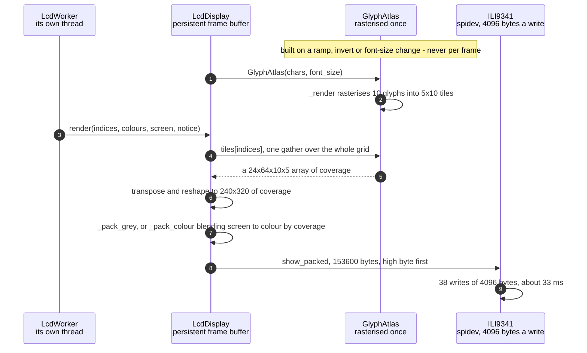

# The character grid is packed into RGB565 pixels for the ILI9341

**Priority: `HIGH`** — every frame the panel shows is built here, and in the enclosure the panel is the only output there is. [What the priorities mean](../how-to-write-scenario-docs.md).

A 64x24 grid of ramp positions has to become 153,600 bytes in the panel's own
byte order, fifteen times a second, on a machine with one slow core. The value
is that it costs about **3.7 ms of CPU** — 1.2 for the glyphs and 2.4 for the
packing — against 33 ms of SPI transfer for the same frame. The drawing is not
what is expensive here, and that is the result of two decisions rather than an
accident.

The first is that glyphs are **never drawn per cell**. A `draw.text` call per
character at 64x24 would be 1,536 PIL calls a frame; instead every character of
the ramp is rasterised once into a fixed-size tile when the atlas is built, and
a frame is one numpy gather from that tile array. At font size 8 the cells are
5x10 pixels and ten of them tile 320x240 exactly at 64x24 — which is also why
that font size is the default.

The second is that the packing never materialises a three-channel image. RGB565
puts red and blue in five bits and green in six, high byte first, and the shifts
that produce it can be done straight from the coverage image in greyscale, where
red, green and blue are all the same number. Grey 200 becomes `0xce 0x59`, which
is r=25, g=50, b=25 in the panel's own scale.

Colour is where it gets interesting, because the coverage is not a mask but a
**fade**. A pixel the glyph misses entirely comes out as the scheme's unlit
screen colour, one the glyph fully covers as the cell's own colour, and the
antialiased edge lands in between. That is one blend per pixel over 76,800
pixels, so the black-screen case — which is greyscale and the live scheme, and
therefore most of the time — is special-cased into a plain modulate that stays
in `uint16` and skips an `int32` promotion. It is worth about 7 ms a frame.

| Class | What it represents, and its part in this scenario |
|---|---|
| [`GlyphAtlas`](../../src/lcd/lcd_display.py#L46) | Every character of a ramp, pre-rendered into a fixed-size cell. Here it is the **type case**: [`_render`](../../src/lcd/lcd_display.py#L69) rasterises each glyph exactly once, and warns about any the font lacks rather than letting them come out blank |
| [`LcdDisplay`](../../src/lcd/lcd_display.py#L98) | An ASCII grid turned into pixels. Here it is the **compositor**: [`_blit`](../../src/lcd/lcd_display.py#L339) is one gather and a reshape, and [`_pack_colour`](../../src/lcd/lcd_display.py#L360) turns coverage into a blend rather than a stencil |
| [`ILI9341`](../../src/lcd/lcd.py#L47) | The panel over spidev. Here it is the **byte sink**, and it dictates the format: [`show_packed`](../../src/lcd/lcd.py#L186) takes bytes already in the panel's layout and checks the length against the panel's own geometry rather than trusting it |

## One grid of indices, one frame of RGB565

| Step | Message | What is going on |
|---:|---|---|
| 1 | [`GlyphAtlas`](../../src/lcd/lcd_display.py#L46)`(chars, font_size)` | The characters arrive **already inverted** if that was asked for, so the atlas holds the ramp in the order it will be indexed. That is what lets the position table stay untouched by `invert` while both displays still choose the same glyph |
| 2 | [`_render`](../../src/lcd/lcd_display.py#L69) rasterises 10 glyphs into 5x10 tiles | Cell width from the advance of `M` — monospace, so any character is a witness — and height from the font's ascent plus descent. A glyph the font lacks would come out blank or as a `.notdef` box, so a missing one is warned about by name rather than left to look like a broken picture |
| 3 | [`render`](../../src/lcd/lcd_display.py#L299)`(indices, colours, screen, notice)` | `screen` is the scheme's unlit colour and is not decoration: every pixel no glyph covers becomes it. `colours` being `None` is not a missing argument but the cheapest instruction available — draw white on black |
| 4 | tiles[indices], one gather over the whole grid | The whole point. 1,536 cells are indexed in a single numpy operation rather than 1,536 PIL calls, and the tiles were rasterised once when the atlas was built rather than once per frame |
| 5 | a 24x64x10x5 array of coverage | Four-dimensional and in the wrong order: cell rows and pixel rows are interleaved the wrong way for a picture. Nothing has been copied yet |
| 6 | transpose and reshape to 240x320 of coverage | `transpose(0, 2, 1, 3)` puts the cell's pixel rows inside the picture's rows, and the reshape flattens it into an image. Coverage is 0 to 255 per pixel — the `@` glyph peaks at 239 rather than 255, because the rasteriser antialiases |
| 7 | [`_pack_grey`](../../src/lcd/lcd_display.py#L353), or [`_pack_colour`](../../src/lcd/lcd_display.py#L360) blending screen to colour by coverage | Greyscale packs straight from the single coverage channel, since red, green and blue are all the same number and the bit twiddling collapses — a three-channel image is never built. Colour repeats one colour per cell up to one per pixel and blends. The black-screen case is special-cased to a modulate that stays in `uint16`, worth about 7 ms a frame, and the general case uses `(coverage + 1) >> 8` rather than a divide by 255: exact at both ends, and it saves a division over 76,800 pixels |
| 8 | [`show_packed`](../../src/lcd/lcd.py#L186), 153600 bytes, high byte first | Already in the panel's layout, so this path skips the PIL round trip and the conversion `show` would do. The length is checked against the panel's own width and height — a buffer of the wrong size would otherwise be written as a window's worth of garbage |
| 9 | 38 writes of 4096 bytes, about 33 ms | `/sys/module/spidev/parameters/bufsiz` is 4,096, so a frame cannot go in one call. The transfer dominates: against it the 3.7 ms of drawing is noise, which is why effort went into not drawing per cell rather than into the clock rate |

No thread bands: every message here is on the LCD worker's thread. That the
worker exists at all is what makes 33 ms of transfer affordable, and it is
drawn in its own scenario rather than repeated here.

The frame buffer is **persistent** between calls, which matters twice. It is
what lets a notice be painted over a picture that is not being redrawn, and it
is the trap that `_rebuild` and `clear_notice` both have to guard: a larger
font gives a *smaller* picture, and nothing ever writes to the margin it no
longer reaches, so the buffer must be zeroed rather than left.

## Related scenarios

- [A frame reaches the SPI panel without stalling the render loop](a-frame-reaches-the-spi-panel-without-stalling-the-render-loop.md)
  — the thread all of this runs on, and how the frame got to it.
- [Pixel brightness is mapped to ramp characters](pixel-brightness-is-mapped-to-ramp-characters.md)
  — where the indices come from, and why the panel wants positions rather than
  characters.
- [A camera that stopped delivering frames is detected and announced](a-camera-that-stopped-delivering-frames-is-detected-and-announced.md)
  — what the persistent frame buffer is for when there is no picture to draw.
- **A colour scheme is compiled into a per-cell lookup table** — where the
  `colours` argument comes from in a tinted scheme.

*(The unlinked entries above are documents not written yet.)*
