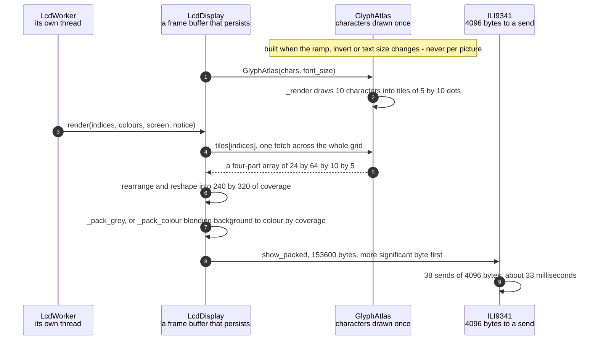

# The character grid is packed into RGB565 pixels for the ILI9341

**Priority: `HIGH`** — every picture the small panel[^panel] shows is built here, and inside the sealed box that panel is the only screen there is. [What the priorities mean](../how-to-write-scenario-docs.md).

A grid[^grid] of 64 character positions across and 24 down has to become 153,600
bytes, arranged exactly as the panel expects them, fifteen times every second,
on a computer with one rather slow processor.

Both of those figures come from the hardware rather than from any choice. The
panel is 240 dots wide and 320 tall, which multiplied together is 76,800 dots.
The panel wants two bytes for each dot, so a complete picture is 153,600 bytes.
The grid of 64 by 24 comes from the same place: at the standard text size each
character occupies a rectangle 5 dots wide and 10 tall, and 64 lots of 5 is
exactly 320 while 24 lots of 10 is exactly 240. Nothing is left over. That exact
fit is precisely why that text size is the standard one.

The value of this scenario is that building the picture costs about **3.7
milliseconds** of processor time, made up of 1.2 milliseconds assembling the
characters and 2.4 packing the colours. Set against the 33 milliseconds it takes
to send the result to the panel, the building is roughly a tenth of the cost.
The drawing is not the expensive part here, and that is the result of two
decisions rather than a happy accident.

**The first decision is that characters are never drawn one cell at a time.**
Asking the imaging library[^pil] to draw text once per cell would mean 64
multiplied by 24 requests, which is 1,536 of them for every picture. Instead
every character of the ramp[^ramp] is converted into dots[^coverage] just once,
into a fixed-size tile, at the moment the collection[^atlas] is built. A whole
picture is then a single operation that fetches the right tiles for the whole
grid at once.

**The second decision is that the packing never builds a three-colour picture at
all.** The panel's format[^rgb565] gives five bits to red, six to green and five
to blue, with the more significant byte first. When the picture is grey[^scheme],
red, green and blue are all the same number, so the packing can be done directly
from the single brightness value. A worked example: a grey value of 200 becomes
the two bytes `0xCE 0x59`. That is arrived at by taking the top five bits of 200
for red, giving 25, the top six for green, giving 50, and the top five again for
blue, giving 25, then packing those three numbers into sixteen bits.

Colour is where it becomes more interesting, because what comes out of drawing a
character is not a simple yes-or-no mask but a **fade**. A dot the character
misses completely takes the colour scheme's unlit background. A dot the character
fills completely takes the cell's own colour. A dot on the smoothed edge of the
character lands somewhere between the two.

That means one blend calculation for each of the 76,800 dots. The case where the
background is black — which covers both grey and the live colour scheme, and so
most of the time — is therefore given its own shorter path, which stays in
smaller numbers and skips a promotion to a larger type. That shortcut is worth
about 7 milliseconds on every picture, which is roughly twice what the whole rest
of the drawing costs.

*Every stage except the last is a rearrangement rather than a calculation, and
that is the reason the drawing costs 3.7 milliseconds against 33 for the
sending. The four-part shape in the middle is the one worth looking at twice: a
cell's ten rows of dots sit together as they were fetched, and one rearranging
step is what moves them into the positions a picture's rows occupy. The strip of
bits at the end is the worked example this document quotes, with a brightness of
200 becoming the two bytes `0xCE 0x59`.*

Kept by hand: edit
[`rgb565-packing.svg`](../images/rgb565-packing.svg) directly, since nothing
regenerates it.

| Class | What it represents, and its part in this scenario |
|---|---|
| [`GlyphAtlas`](../../src/lcd/lcd_display.py#L46) | Every character of a ramp, drawn in advance into a fixed-size tile. In this scenario it is the **type case**, in the sense a printer would use: a tray of ready-made letters. [`_render`](../../src/lcd/lcd_display.py#L69) converts each character into dots exactly once, and warns by name about any character the font does not contain rather than letting it come out blank |
| [`LcdDisplay`](../../src/lcd/lcd_display.py#L98) | A grid of characters turned into actual coloured dots. In this scenario it is the **assembler**. [`_blit`](../../src/lcd/lcd_display.py#L339) is one fetch followed by a rearrangement, and [`_pack_colour`](../../src/lcd/lcd_display.py#L360) treats the drawn characters as a fade to blend through rather than as a stencil to cut with |
| [`ILI9341`](../../src/lcd/lcd.py#L47) | The panel itself, reached through the system's SPI device[^spidev]. In this scenario it is the **destination for the bytes**, and it dictates the format. [`show_packed`](../../src/lcd/lcd.py#L186) accepts bytes already in the panel's own arrangement, and checks their number against the panel's dimensions rather than trusting the caller |

## One grid of positions, one picture of packed dots

```mermaid
sequenceDiagram
    autonumber
    participant W as LcdWorker<br/>its own thread
    participant D as LcdDisplay<br/>a frame buffer that persists
    participant A as GlyphAtlas<br/>characters drawn once
    participant Panel as ILI9341<br/>4096 bytes to a send

    note over A: built when the ramp, invert or text size changes - never per picture
    D->>A: GlyphAtlas(chars, font_size)
    A->>A: _render draws 10 characters into tiles of 5 by 10 dots
    W->>D: render(indices, colours, screen, notice)
    D->>A: tiles[indices], one fetch across the whole grid
    A-->>D: a four-part array of 24 by 64 by 10 by 5
    D->>D: rearrange and reshape into 240 by 320 of coverage
    D->>D: _pack_grey, or _pack_colour blending background to colour by coverage
    D->>Panel: show_packed, 153600 bytes, more significant byte first
    Panel->>Panel: 38 sends of 4096 bytes, about 33 milliseconds
```

| Step | Message | What is going on |
|---:|---|---|
| 1 | [`GlyphAtlas`](../../src/lcd/lcd_display.py#L46)`(chars, font_size)` | The characters arrive **already reversed** if inverting was asked for, so the collection holds the ramp in the order it is going to be looked up in. That is exactly what allows the list of positions to stay untouched by the invert setting[^invert] while both screens still choose the same character |
| 2 | [`_render`](../../src/lcd/lcd_display.py#L69) draws 10 characters into tiles of 5 by 10 dots | Ten characters, because that is how many the usual ramp contains. The width of a cell is taken from the width of a capital `M`, which is reliable because the font is monospaced and every character therefore has the same width. The height comes from how far the font rises above the writing line plus how far it drops below. A character the font does not contain would come out blank or as an empty box, so a missing one is reported by name rather than left to look like a broken picture |
| 3 | [`render`](../../src/lcd/lcd_display.py#L299)`(indices, colours, screen, notice)` | The `screen` value is the colour scheme's unlit background, and it is not decoration: every dot that no character covers becomes it. Passing nothing for `colours` is not a missing argument but the cheapest possible instruction, meaning draw white characters on black |
| 4 | tiles[indices], one fetch across the whole grid | This is the whole point of the arrangement. All 1,536 cells are looked up in a single operation rather than in 1,536 separate requests to the imaging library, and the tiles themselves were drawn once when the collection was built rather than once per picture |
| 5 | a four-part array of 24 by 64 by 10 by 5 | Four dimensions, in the wrong order for a picture: the rows of cells and the rows of dots inside each cell are interleaved the wrong way round. Nothing has been copied at this stage |
| 6 | rearrange and reshape into 240 by 320 of coverage | The rearranging step moves each cell's rows of dots inside the picture's rows, and the reshaping then flattens the result into an ordinary picture. Coverage runs from 0 to 255 for each dot. The `@` character peaks at 239 rather than 255, because drawing smooths the edges of characters and even its densest dot is not quite completely filled |
| 7 | [`_pack_grey`](../../src/lcd/lcd_display.py#L353), or [`_pack_colour`](../../src/lcd/lcd_display.py#L360) blending background to colour by coverage | A grey picture packs straight from the single coverage value, because red, green and blue are all the same number and the bit arithmetic collapses into one calculation. A three-colour picture is never built. A coloured picture repeats each cell's colour out to each of its dots and then blends. The black-background case has its own shorter path worth about 7 milliseconds a picture, and the general case divides by adding one and shifting right by eight rather than dividing by 255. That is exact at both ends of the range and saves a division on every one of 76,800 dots |
| 8 | [`show_packed`](../../src/lcd/lcd.py#L186), 153600 bytes, more significant byte first | Already in the panel's own arrangement, so this path avoids a conversion through the imaging library that the more general method would perform. The number of bytes is checked against the panel's width and height. A buffer of the wrong size would otherwise be written out as a screen's worth of nonsense |
| 9 | 38 sends of 4096 bytes, about 33 milliseconds | The system reports its buffer for this connection as 4,096 bytes, and 153,600 divided by 4,096 is 37.5, so one picture takes 38 sends. The sending dominates everything: against it the 3.7 milliseconds of drawing is almost nothing, which is why the effort went into avoiding per-cell drawing rather than into making the connection run faster |

There are no coloured thread bands in the diagram, because every message here
happens on the panel worker[^lcd]'s thread. That the worker exists at all is
what makes 33 milliseconds of sending affordable, and that is set out in its own
scenario rather than repeated here.

The frame buffer **persists between calls**, and that matters in two different
ways. It is what allows a short message[^notice] to be painted over a picture
that is not currently being redrawn. It is also a trap that two separate pieces
of code have to guard against: a larger text size produces a *smaller* picture,
and nothing ever writes to the margin that the smaller picture no longer reaches.
So the buffer has to be wiped rather than simply left as it was, or the edges of
the previous, larger picture remain visible around the new one.

## Related scenarios

- [A frame reaches the SPI panel without stalling the render loop](a-frame-reaches-the-spi-panel-without-stalling-the-render-loop.md)
  — the thread all of this runs on, and how the camera picture reached it.
- [Pixel brightness is mapped to ramp characters](pixel-brightness-is-mapped-to-ramp-characters.md)
  — where the grid of positions comes from, and why the panel wants positions
  rather than characters.
- [A camera that stopped delivering frames is detected and announced](a-camera-that-stopped-delivering-frames-is-detected-and-announced.md)
  — what the persisting frame buffer is for when there is no picture to draw.
- [A colour scheme is compiled into a per-cell lookup table](a-colour-scheme-is-compiled-into-a-per-cell-lookup-table.md)
  — where the colours come from when the chosen scheme is a tint.

### Footnotes

[^panel]: The **SPI panel** is a small screen measuring 2.4 inches across the
    diagonal, 240 dots by 320, using a controller chip called the ILI9341. It is
    connected to the computer by a simple four-wire arrangement called SPI, which
    is a common way of attaching small devices. It is driven entirely by the
    program itself, through [`ILI9341`](../../src/lcd/lcd.py#L47), with no
    separate system driver involved. In the sealed box this program is built
    for, this panel is the only screen there is. One complete picture for it is
    153,600 bytes, which has to be sent in pieces of 4 kilobytes each — see
    [`SPI_CHUNK`](../../src/lcd/lcd.py#L44) — because that is as much as the
    connection will accept at a time.

[^grid]: The **character grid** is how this program holds a picture: as a
    rectangle of character cells rather than of dots. Each cell is one
    character, chosen according to how bright the patch of camera picture behind
    it happens to be. [`to_grid`](../../src/capture/image_processor.py#L172) is
    the code that reduces a picture to that grid. How many cells there are
    depends on where the picture is being sent — 64 across and 24 down on the
    small attached panel at the usual text size, and whatever fits the window
    when the picture goes to an ordinary monitor instead.

[^pil]: The **Python Imaging Library**, distributed under the name Pillow, is
    the standard library for handling pictures in Python. In this program it is
    what draws the individual characters into the prepared collection, and what
    the panel's slower alternative path uses to convert a picture. The cost of
    calling it is the thing this program arranges itself to avoid: one call that
    handles a whole picture is perfectly fine, while 1,536 calls that each
    handle one cell are not.

[^ramp]: A **ramp** is the set of characters a picture is drawn with, arranged
    in order from the one that looks lightest to the one that looks darkest.
    The sequence ` .:-=+*#%@` is one example. A brightness value picks a
    position along that sequence, so the choice of ramp decides how the picture
    looks before any colour is involved at all. The named ramps are listed in
    [`RAMPS`](../../src/art/ascii_art.py#L17), and a setting chooses between
    them.

[^coverage]: **Drawing a character into dots** turns its outline into a small
    picture, and what comes out is a measure called **coverage**: how much of
    each dot the shape actually fills, on a scale from 0 to 255. Dots along the
    edge land somewhere in between, which is what smoothing means. It matters
    here that coverage is a fade rather than a simple yes or no, because the
    panel uses it to blend the cell's colour towards the unlit background. That
    is why the `@` character peaking at 239 instead of 255 is a visible fact
    rather than a technicality.

[^atlas]: A **glyph atlas** is a collection of ready-made character pictures.
    Every character of the *ramp*, which is ten of them for the usual ramp
    rather than a whole font, is drawn once in advance into a single array. The
    code for it is [`GlyphAtlas`](../../src/lcd/lcd_display.py#L46). A complete
    screen is then assembled by copying the right rectangles out of that
    collection, instead of drawing any text. On a grid of 64 by 24 that is one
    array operation rather than 1,536 separate requests to a font renderer.
    Because the collection holds the ramp and not a font, changing the ramp is
    what forces it to be built again.

[^rgb565]: **RGB565** is the way the small panel wants each dot to be described:
    two bytes altogether, holding five bits of red, six bits of green and five
    bits of blue. Green is given the spare bit because human eyes notice
    differences in green more readily than differences in red or blue.
    [`rgb565`](../../src/lcd/lcd.py#L271) converts a single colour into that
    form, and [`pack_rgb565`](../../src/lcd/lcd.py#L254) converts a whole
    picture at once.

[^scheme]: A **colour scheme** is one of the nine named looks listed in
    [`SCHEMES`](../../src/art/palettes.py#L79). Which one is currently in use is
    part of the program's render configuration, and the knob, a key press or a
    typed command can all change it. The scheme called `grey` is the one the
    program starts with, and it is what the phrase "greyscale mode" refers to:
    characters only, worked out from the brightness part of the picture and
    nothing else. Only the scheme called `live` reads the colour parts, through
    [`colour_grid`](../../src/capture/image_processor.py#L187). The remaining
    seven are tints, such as green phosphor, amber CRT and e-ink on paper. A
    tint recolours the same greyscale picture using two fixed colours, so it
    never looks at the colour parts either.

[^spidev]: **spidev** is the system's way of letting an ordinary program talk
    directly to the SPI connection, and it appears as a file at
    `/dev/spidev0.0`. No display driver is attached to this panel at all. The
    program drives it through that file, which is why nothing here behaves like
    a normal screen as far as the system is concerned. The buffer belonging to
    that connection holds 4,096 bytes, and that single fact is the entire reason
    one picture takes 38 sends rather than one.

[^invert]: The **invert** setting reverses the ramp, so that bright parts of the
    scene are drawn with the dark end of the character sequence instead. In
    effect it turns a light-on-dark picture into a dark-on-light one. It
    reverses the characters and deliberately leaves the list of positions
    untouched, which is how both screens stay in agreement about which
    character a given brightness deserves.

[^lcd]: The **LCD worker** is the part of the program, represented by the class
    [`LcdWorker`](../../src/lcd/lcd_worker.py#L61), that owns the second screen.
    That screen is a small panel measuring 2.4 inches across the diagonal, 240
    by 320 dots, connected by a simple wiring arrangement called SPI. In the
    sealed box this program is built for, that small panel is the only screen
    there is. It is given a thread of its own because sending one picture down
    the wire to it takes about 33 milliseconds, and the drawing loop must not
    spend that time waiting.

[^notice]: A **notice** is a short message painted over the bottom of whatever
    picture is currently on the small panel. It is two lines in a fixed colour,
    laid over the top of the existing picture, and its height is set by
    [`NOTICE_LINES`](../../src/lcd/lcd_display.py#L37). It is how a box with no
    keyboard and no monitor tells somebody that something has gone wrong. It
    covers 36 of the panel's 240 rows of dots.
