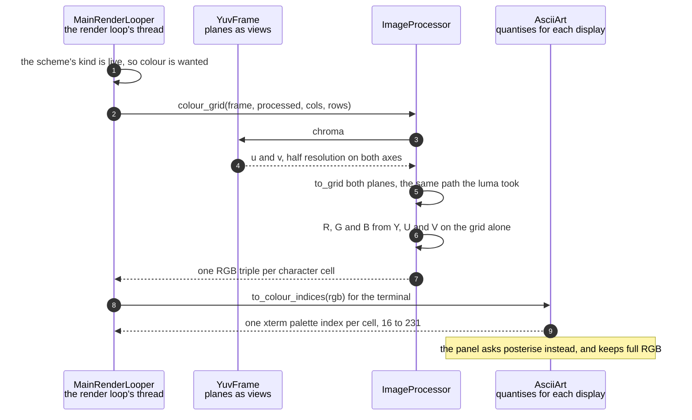

# The chroma planes give each character cell its colour

**Priority: `MEDIUM`** — only the live scheme reads the chroma[^yuv], and the default is grey, so this runs on every frame or on none. [What the priorities mean](../how-to-write-scenario-docs.md).

In the live scheme each character is drawn in the colour of the thing it
stands for: a red mug comes out as red characters. The value is that this
costs almost nothing, because the colour is computed **after** the frame has
been reduced to the character grid[^grid]. At 133x50 that is about 6,650
conversions per frame instead of 76,800 at sensor resolution, and doing it the
other way round was the single most expensive thing in the original pipeline.

The saving is only available because the capture already holds the chroma.
YUV420 carries two half-resolution planes beside the luma, and
[`_wrap`](../../src/capture/camera.py#L151) keeps all three in one copy — so
by the time a colour scheme[^scheme] wants them, nothing needs fetching or
decoding. Greyscale ignores them entirely, which is why the 38 KB they cost is
paid on every frame and used on some.

The part that matters for correctness is that the colour and the character must
be derived from the **same** brightness. `colour_grid` is handed the already
processed luma grid rather than recomputing one, so the Y term in the
conversion is exactly the value that chose the cell's character. If the two
were computed separately, a cell could end up with a bright character in a dark
colour, and the picture would look subtly wrong in a way that is very hard to
attribute.

*The saving is entirely in where the arithmetic sits: three coefficients per
cell, on a few thousand cells, rather than on 76,800 pixels. The cell in the
middle is the load-bearing part — its `Y` is the luma grid that already chose
the character, handed back in rather than worked out again. The two swatches at
the bottom are real: `Y 120, U 90, V 200` gives `220, 81, 52`, which the
terminal can only render as xterm 167.*

Kept by hand: edit
[`chroma-to-cell-colour.svg`](../images/chroma-to-cell-colour.svg) directly,
since nothing regenerates it.

| Class | What it represents, and its part in this scenario |
|---|---|
| [`YuvFrame`](../../src/capture/camera.py#L22) | One YUV420 frame, exposing its planes as views[^view] rather than copies. Here it is the **source of the colour**: [`chroma`](../../src/capture/camera.py#L51) is offset arithmetic over the buffer already in hand, not a decode, and the two planes are half resolution on both axes |
| [`ImageProcessor`](../../src/capture/image_processor.py#L49) | Rotate, crop, resize, levels. Here it is the **converter**: [`colour_grid`](../../src/capture/image_processor.py#L187) reduces both chroma planes through the same path the luma took, then does the YUV to RGB arithmetic on the grid rather than on the frame |
| [`AsciiArt`](../../src/art/ascii_art.py#L81) | Brightness to characters, and colour to whatever a display can show. Here it is the **quantiser**, and it has two of them: [`to_colour_indices`](../../src/art/ascii_art.py#L115) for the terminal's palette[^xterm] and [`posterise`](../../src/art/ascii_art.py#L130) for the panel[^panel]'s full RGB |

## One frame's colour, in the live scheme

| Step | Message | What is going on |
|---:|---|---|
| 1 | the scheme's kind is live, so colour is wanted | Decided in [`_colours_for`](../../ascii_camera.py#L498). Greyscale returns `None`, which is not a missing value but the cheapest instruction there is — draw in the terminal's own foreground colour. A tinted scheme takes a third path and never touches the chroma either |
| 2 | [`colour_grid`](../../src/capture/image_processor.py#L187)`(frame, processed, cols, rows)` | The whole frame goes in, because the chroma is still on it, and so does the **already processed** luma grid. Passing that back in rather than recomputing it is what guarantees the colour and the character come from one brightness |
| 3 | [`chroma`](../../src/capture/camera.py#L51) | Offsets into the buffer the capture already copied: the flat region below the luma is split in half and each half reshaped. No decoding, and no second copy |
| 4 | u and v, half resolution on both axes | A quarter of the pixels each — 19,200 bytes apiece at 320x240, against 76,800 for the luma. **U before V**, which was settled by capturing a reference RGB888[^rgb888] of the same scene rather than read off a diagram: the wrong order swaps blue and red, which looks plausible enough to survive a glance |
| 5 | [`to_grid`](../../src/capture/image_processor.py#L172) both planes, the same path the luma took | The same rotate, the same crop, the same resample. Sharing the method is not tidiness — any difference in rotation or cropping between the planes would show as colour fringing along every edge in the picture |
| 6 | R, G and B from Y, U and V on the grid alone | The standard coefficients, on a few thousand cells. This is the step that is cheap because of where it sits: doing it before the reduction would be the same arithmetic over eleven times as many values |
| 7 | one RGB triple per character cell | Full RGB, and deliberately not yet quantised. What a display can actually show is that display's business, and the two disagree completely |
| 8 | [`to_colour_indices`](../../src/art/ascii_art.py#L115)`(rgb)` for the terminal | The terminal has no RGB. It has a 6x6x6 cube at palette entries 16 to 231, so each channel is snapped to one of six levels and the three combined arithmetically. Red comes out as 196, green as 46, blue as 21 |
| 9 | one xterm palette index per cell, 16 to 231 | Quantisation happens here for free: choosing among fewer cube steps **is** the `colour_levels`[^posterise] setting on the terminal, so there is nothing extra to apply |

The note is not a step, because it happens on another thread entirely. The
panel has no palette to snap against, so `colour_levels` has to be applied to
the RGB itself by [`posterise`](../../src/art/ascii_art.py#L130) — and until
that existed the setting did nothing at all on a headless[^headless] run,
which is the deployed one, because the quantiser was only ever reached by the
terminal.

No thread bands, for the same reason: nothing crosses. The panel is handed the
*frame* and repeats the whole reduction at its own size, computing its own
colour grid from the same chroma planes.

## Related scenarios

- [One YUV420 capture carries greyscale and colour without converting either](one-yuv420-capture-carries-greyscale-and-colour-without-converting-either.md)
  — where the chroma planes come from, and why keeping them costs 38 KB.
- [ImageProcessor rotates, crops and resizes a frame to the character grid](imageprocessor-rotates-crops-and-resizes-a-frame-to-the-character-grid.md)
  — the reduction the chroma is put through, shared with the luma so the planes
  stay in register.
- [Pixel brightness is mapped to ramp characters](pixel-brightness-is-mapped-to-ramp-characters.md)
  — the character each of these colours is applied to.
- [A colour scheme is compiled into a per-cell lookup table](a-colour-scheme-is-compiled-into-a-per-cell-lookup-table.md)
  — what the other eight schemes do instead, which never reads the chroma at
  all.

### Footnotes

[^yuv]: **YUV420** keeps a frame as brightness and colour separately rather
    than as pixels. The **luma** plane, Y, carries one brightness byte per
    pixel; the two **chroma** planes, U and V, carry colour at half resolution
    on each axis, so a quarter of the samples each. All three arrive in one
    buffer of `height * 3 / 2` rows — Y first, then U and V packed together —
    which is the layout [`chroma`](../../src/capture/camera.py#L51) unpacks. At
    320x240 that is 76,800 bytes of luma and 38,400 of chroma.

[^grid]: The **character grid** is the picture as this app holds it: `rows` by
    `cols` character **cells** rather than pixels, each cell one character
    chosen from the brightness of the patch of camera frame it covers.
    [`to_grid`](../../src/capture/image_processor.py#L172) is what resizes a
    plane to it. How big it is depends on where the picture is going — 64 by 24
    on the SPI panel at the default font size, and whatever the window holds on
    the HDMI terminal.

[^scheme]: A **colour scheme** is one of the nine named looks in
    [`SCHEMES`](../../src/art/palettes.py#L79), and which one is live is part
    of the render configuration. `grey` is the default, and is what "greyscale
    mode" means: characters only, drawn from the luma plane and nothing else.
    `live` is the only scheme that reads the chroma planes, through
    [`colour_grid`](../../src/capture/image_processor.py#L187). The other seven
    are **tints** — green phosphor, amber CRT, e-ink on paper — which recolour
    the same greyscale picture from two fixed colours.

[^view]: A numpy **view** is a second array object pointing into the first
    one's memory. Slicing copies no bytes, which is why
    [`luma`](../../src/capture/camera.py#L47) costs nothing to take — and why
    every reader of a frame is a reader only: several views of one buffer are
    safe to share across threads exactly as long as nothing writes through any
    of them.

[^xterm]: A terminal cannot show an arbitrary colour. It has a fixed palette —
    216 cube entries plus 24 greys, the 240 that
    [`XTERM_RGB`](../../src/art/palettes.py#L66) holds — so every colour the
    app computes has to be snapped to the nearest one by
    [`nearest_xterm`](../../src/art/palettes.py#L117). The panel has no such
    limit, which is why the same scheme is compiled twice.

[^panel]: The **SPI panel** is a 2.4 inch ILI9341 LCD, 240x320, wired to the
    Pi's SPI bus — a four-wire serial bus for talking to peripherals — and
    driven from userspace by [`ILI9341`](../../src/lcd/lcd.py#L47) with no
    kernel driver behind it. In the sealed enclosure it is the only display
    there is. One full frame is 153,600 bytes, sent in
    [`SPI_CHUNK`](../../src/lcd/lcd.py#L44) pieces of 4 KB because that is what
    the driver's buffer holds.

[^rgb888]: **RGB888** is the ordinary uncompressed form — one byte each of red,
    green and blue per pixel — as opposed to the panel's packed RGB565 or the
    camera's YUV420. Here it is used only as a reference capture to check
    something against.

[^posterise]: To **posterise** is to round colours to a coarser set of steps,
    which is what the `colour_levels` setting asks for.
    [`posterise`](../../src/art/ascii_art.py#L130) does it to the panel's RGB;
    the terminal gets it for nothing, since snapping to a fixed palette is
    already a rounding.

[^headless]: `--no-terminal` runs the app with no terminal picture at all — a
    stand-in object with the same methods as the display, which does nothing.
    The enclosure boots that way, because there is no monitor attached, so the
    terminal's cost is not wasted so much as never paid.
