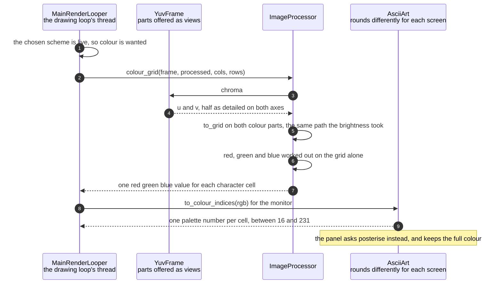

# The chroma planes give each character cell its colour

**Priority: `MEDIUM`** — only the scheme called live reads the colour parts[^yuv] of a camera picture, and the program starts in grey, so this runs on every picture or on none at all. [What the priorities mean](../how-to-write-scenario-docs.md).

In the scheme called live, every character is drawn in the colour of the thing
it stands for. A red mug appears on screen as red characters.

The value is that this costs almost nothing, because the colour is worked out
**after** the camera picture has been reduced to the grid of characters[^grid],
rather than before. The size of that saving depends on the grid. Inside the
sealed box, which is the arrangement this program is really built for, the grid
is 64 cells across and 24 down, or 1,536 cells altogether. The camera picture
that grid was made from is 320 dots by 240, which is 76,800 dots. So working out
the colour after the reduction means about 1,536 conversions for each picture
instead of 76,800, which is fifty times fewer. Doing it in the other order was
the single most expensive thing the program used to do.

That saving is only available because the camera picture already carries the
colour information. The YUV420 format holds two colour parts alongside the
brightness, each at half the detail across and half the detail down. The code in
[`_wrap`](../../src/capture/camera.py#L151) keeps all three parts inside one
copy, so by the time a colour scheme[^scheme] wants them, there is nothing left
to fetch and nothing to decode. Drawing in grey ignores them completely, which is
why the 38 kilobytes they occupy is paid for on every picture and used on only
some of them.

The part that matters for correctness is different from the part that matters
for speed, and it is worth separating them.

For the picture to look right, the colour and the character must both be worked
out from the **same** brightness. The colour code is therefore handed the
brightness grid that has already been calculated, rather than working out a
fresh one of its own. That means the brightness used in the colour conversion is
exactly the value that chose the cell's character. If the two were worked out
separately, a cell could end up showing a bright character in a dark colour.
The picture would then look subtly wrong in a way that is very difficult to
trace back to its cause.

*The whole saving lies in where the arithmetic sits: three multiplications for
each cell, performed on a few thousand cells, rather than on 76,800 dots. The
magnified cell in the middle is the part everything else rests on. Its
brightness value is taken from the grid that already chose the character, handed
back in rather than worked out a second time. The two colour patches at the
bottom are real values rather than illustrations: a brightness of 120 with
colour values of 90 and 200 produces the red-green-blue triple 220, 81, 52,
which an ordinary monitor can only show as entry 167 of its fixed set of
colours.*

Kept by hand: edit
[`chroma-to-cell-colour.svg`](../images/chroma-to-cell-colour.svg) directly,
since nothing regenerates it.

| Class | What it represents, and its part in this scenario |
|---|---|
| [`YuvFrame`](../../src/capture/camera.py#L22) | One picture from the camera, offering its parts as views[^view] of memory rather than as copies. In this scenario it is the **source of the colour**. [`chroma`](../../src/capture/camera.py#L51) works out positions within the memory already in hand rather than decoding anything, and the two colour parts it produces are half as detailed across and half as detailed down |
| [`ImageProcessor`](../../src/capture/image_processor.py#L49) | The part that turns, trims, shrinks and adjusts the brightness of a picture. In this scenario it is the **converter**. [`colour_grid`](../../src/capture/image_processor.py#L187) reduces both colour parts through exactly the same path the brightness took, and then performs the conversion into red, green and blue on the grid rather than on the full camera picture |
| [`AsciiArt`](../../src/art/ascii_art.py#L81) | Brightness turned into characters, and colour turned into whatever a particular screen is able to display. In this scenario it is the **rounder**, and it has two separate ways of rounding: [`to_colour_indices`](../../src/art/ascii_art.py#L115) for a monitor's fixed set of colours[^xterm], and [`posterise`](../../src/art/ascii_art.py#L130) for the small panel[^panel], which can show any colour it is given |

## One picture's colour, in the live scheme

```mermaid
sequenceDiagram
    autonumber
    participant App as MainRenderLooper<br/>the drawing loop's thread
    participant F as YuvFrame<br/>parts offered as views
    participant Proc as ImageProcessor
    participant Art as AsciiArt<br/>rounds differently for each screen

    App->>App: the chosen scheme is live, so colour is wanted
    App->>Proc: colour_grid(frame, processed, cols, rows)
    Proc->>F: chroma
    F-->>Proc: u and v, half as detailed on both axes
    Proc->>Proc: to_grid on both colour parts, the same path the brightness took
    Proc->>Proc: red, green and blue worked out on the grid alone
    Proc-->>App: one red green blue value for each character cell
    App->>Art: to_colour_indices(rgb) for the monitor
    Art-->>App: one palette number per cell, between 16 and 231
    Note over Art: the panel asks posterise instead, and keeps the full colour
```

| Step | Message | What is going on |
|---:|---|---|
| 1 | the chosen scheme is live, so colour is wanted | Decided in [`_colours_for`](../../ascii_camera.py#L499). Choosing grey hands back nothing at all, which is not a missing value but the cheapest possible instruction: draw everything in whatever colour the terminal normally uses. A tinted scheme takes a third path and never looks at the colour parts either |
| 2 | [`colour_grid`](../../src/capture/image_processor.py#L187)`(frame, processed, cols, rows)` | The whole camera picture goes in, because the colour parts are still attached to it, and so does the **already reduced** brightness grid. Passing that grid back in rather than working out a new one is exactly what guarantees the colour and the character are derived from one and the same brightness |
| 3 | [`chroma`](../../src/capture/camera.py#L51) | Positions within the memory the camera code already copied. The flat region beneath the brightness is divided in half and each half treated as a rectangle. Nothing is decoded and no second copy is made |
| 4 | u and v, half as detailed on both axes | Half the detail across multiplied by half the detail down is a quarter, so each colour part holds a quarter as many values as the brightness does. At 320 by 240 that is 19,200 bytes for each of them, against 76,800 for the brightness. **U comes before V**, which was settled by photographing a scene and capturing the same scene again in an ordinary red-green-blue format[^rgb888] as a reference, rather than by reading a diagram. Taking them the wrong way round exchanges blue and red, and the result still looks plausible enough to survive a quick glance |
| 5 | [`to_grid`](../../src/capture/image_processor.py#L172) on both colour parts, the same path the brightness took | The same turning, the same trimming, the same shrinking. Sharing one piece of code is not tidiness for its own sake. Any difference at all in how the colour parts were turned or trimmed compared with the brightness would appear as coloured edges around every object in the picture |
| 6 | red, green and blue worked out on the grid alone | The standard conversion, applied to a few thousand cells. This is the step that is cheap purely because of where it sits in the order. Performing it before the reduction would be exactly the same arithmetic carried out on fifty times as many values |
| 7 | one red green blue value for each character cell | Full colour, and deliberately not yet rounded to anything. What a particular screen can actually display is that screen's own business, and the two screens in this program disagree completely about it |
| 8 | [`to_colour_indices`](../../src/art/ascii_art.py#L115)`(rgb)` for the monitor | An ordinary terminal cannot display any colour asked of it. It offers a fixed set instead. Part of that set is arranged as a cube with six steps along each of the three colour axes, giving 6 multiplied by 6 multiplied by 6, which is 216 entries, numbered from 16 to 231. So each of the three colours is rounded to one of six levels and the three are then combined arithmetically into a single number. Pure red comes out as 196, pure green as 46 and pure blue as 21 |
| 9 | one palette number per cell, between 16 and 231 | Rounding to coarser steps happens here at no extra cost. Choosing among fewer of the cube's six levels **is** what the `colour_levels` setting[^posterise] does on a monitor, so there is nothing additional to apply afterwards |

The note in the diagram is not numbered as a step, because it happens on an
entirely different thread. The small panel has no fixed set of colours to round
against, so the `colour_levels` setting has to be applied to the full colour
values themselves, which is what
[`posterise`](../../src/art/ascii_art.py#L130) does. Until that code existed,
the setting did nothing whatsoever on a run with no monitor[^headless], which is
the run the sealed box actually performs, because the only rounding code was
reached exclusively by way of the monitor.

There are no coloured thread bands in the diagram, for the same reason as in
several other scenarios: nothing crosses between threads here. The panel is
handed the camera *picture* and repeats the whole reduction at its own size,
working out its own grid of colours from the same two colour parts.

## Related scenarios

- [One YUV420 capture carries greyscale and colour without converting either](one-yuv420-capture-carries-greyscale-and-colour-without-converting-either.md)
  — where the colour parts come from in the first place, and why keeping them
  costs 38 kilobytes.
- [ImageProcessor rotates, crops and resizes a frame to the character grid](imageprocessor-rotates-crops-and-resizes-a-frame-to-the-character-grid.md)
  — the reduction the colour parts are put through, shared with the brightness
  so that all three stay lined up with one another.
- [Pixel brightness is mapped to ramp characters](pixel-brightness-is-mapped-to-ramp-characters.md)
  — the character that each of these colours is then applied to.
- [A colour scheme is compiled into a per-cell lookup table](a-colour-scheme-is-compiled-into-a-per-cell-lookup-table.md)
  — what the other eight schemes do instead, none of which reads the colour
  parts at all.

### Footnotes

[^yuv]: **YUV420** is a way of storing a picture that keeps brightness and
    colour separately, instead of storing a colour for every dot. The brightness
    part, called the luma, holds one brightness value for every dot in the
    picture. The two colour parts, called the chroma, hold colour information at
    half the detail across and half the detail down, so each of them holds a
    quarter as many values as the brightness part does. All three parts arrive
    together in one piece of memory: the brightness first, then the two colour
    parts packed in after it. That arrangement is what
    [`chroma`](../../src/capture/camera.py#L51) knows how to take apart. At 320
    by 240 the brightness part is 76,800 bytes and the two colour parts together
    are 38,400 bytes.

[^grid]: The **character grid** is how this program holds a picture: as a
    rectangle of character cells rather than of dots. Each cell is one
    character, chosen according to how bright the patch of camera picture behind
    it happens to be. [`to_grid`](../../src/capture/image_processor.py#L172) is
    the code that reduces a picture to that grid. How many cells there are
    depends on where the picture is being sent — 64 across and 24 down on the
    small attached panel at the usual text size, and whatever fits the window
    when the picture goes to an ordinary monitor instead.

[^scheme]: A **colour scheme** is one of the nine named looks listed in
    [`SCHEMES`](../../src/art/palettes.py#L79). Which one is currently in use is
    part of the program's render configuration, and the knob, a key press or a
    typed command can all change it. The scheme called `grey` is the one the
    program starts with, and it is what the phrase "greyscale mode" refers to:
    characters only, worked out from the brightness part of the picture and
    nothing else. Only the scheme called `live` reads the colour parts, through
    [`colour_grid`](../../src/capture/image_processor.py#L187). The remaining
    seven are tints, such as green phosphor, amber CRT and e-ink on paper. A
    tint recolours the same greyscale picture using two fixed colours, so it
    never looks at the colour parts either.

[^view]: A **view** is a second way of looking at memory that already exists,
    rather than a copy of it. When the program takes the brightness part out of
    a picture using [`luma`](../../src/capture/camera.py#L47), no bytes are
    copied and no new memory is used. This is also the reason every part of this
    scenario only ever reads. Several views of one piece of memory are perfectly
    safe to share between threads, for exactly as long as nothing writes through
    any of them.

[^xterm]: An ordinary terminal cannot display any colour that is asked of it. It
    offers a fixed set instead, made up of 216 colours arranged as a cube plus
    24 shades of grey, giving 240 in total. Those are what
    [`XTERM_RGB`](../../src/art/palettes.py#L66) holds. Every colour the program
    works out therefore has to be rounded to the nearest one of them by
    [`nearest_xterm`](../../src/art/palettes.py#L117). The small attached panel
    has no such restriction, and that difference is exactly why the same colour
    scheme has to be prepared twice, once for each screen.

[^panel]: The **SPI panel** is a small screen measuring 2.4 inches across the
    diagonal, 240 dots by 320, using a controller chip called the ILI9341. It is
    connected to the computer by a simple four-wire arrangement called SPI, which
    is a common way of attaching small devices. It is driven entirely by the
    program itself, through [`ILI9341`](../../src/lcd/lcd.py#L47), with no
    separate system driver involved. In the sealed box this program is built
    for, this panel is the only screen there is. One complete picture for it is
    153,600 bytes, which has to be sent in pieces of 4 kilobytes each — see
    [`SPI_CHUNK`](../../src/lcd/lcd.py#L44) — because that is as much as the
    connection will accept at a time.

[^rgb888]: **RGB888** is the ordinary, straightforward way of storing a colour
    picture: one byte for red, one for green and one for blue, for every single
    dot. It is written that way because each of the three colours gets eight
    bits of memory. It is mentioned here only because a photograph stored in
    that form was used as a reference to check something against. The small
    attached panel uses a more tightly packed arrangement, and the camera uses
    YUV420, so this ordinary form appears nowhere else in the program.

[^posterise]: To **posterise** a picture is to round its colours to a smaller
    number of coarser steps, which is what the `colour_levels` setting asks for.
    [`posterise`](../../src/art/ascii_art.py#L130) performs that rounding on the
    full colour values destined for the small panel. A monitor gets the same
    effect for nothing, because rounding to a fixed set of colours is already a
    rounding of exactly that kind.

[^headless]: The option `--no-terminal` runs the program with no monitor
    picture at all. A stand-in object is used, offering all the same methods as
    a real display but doing nothing when they are called. The sealed box starts
    up that way, because there is no monitor attached to it, so the cost of
    building a monitor picture is not so much wasted as never paid in the first
    place.
