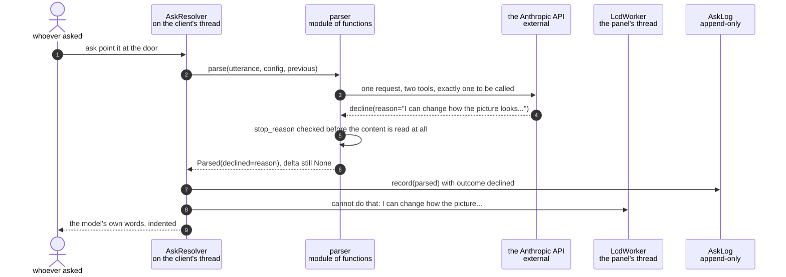

# The language model declines a request it cannot satisfy

**Priority: `LOW`** — it needs the optional ask path switched on, and it is the outcome nobody designs for first, but it is what stops the camera inventing an answer. [What the priorities mean](../how-to-write-scenario-docs.md).

`ask point it at the door` is a perfectly sensible thing to say to a camera and
an impossible thing for this one to do. Nothing in the settings moves a lens.
The failure mode worth preventing is not a crash — it is the model quietly
picking the nearest setting it *can* change, so the picture goes green and
nobody learns that the request was never understood.

**So declining is a first-class answer with its own tool.** The model is given
[two tools and told to call exactly one](../../src/language/parser.py#L204):
`set_render` to change something, or `decline` to say why not. It cannot reply
with prose, because a third output shape is one nothing downstream handles.

**A decline is not a failure.** It travels a different path from a
[`ParseError`](a-model-parse-fails-and-the-panel-says-which-kind-of-failure-it-was.md):
nothing is logged as an error, the reply carries the model's own words rather
than a summary, and the panel says `cannot do that:` followed by the reason. The
distinction is load-bearing in the log, where a decline is evidence the system
worked and an error is evidence it did not.

| Class | What it represents, and its part in this scenario |
|---|---|
| [`AskResolver`](../../src/language/resolver.py#L33) | The whole of the ask path. Here it is the **router**: a decline is checked for before a delta, and sent to the panel and the socket without ever reaching the render loop |
| [`parser`](../../src/language/parser.py) | A module of functions, not a class. Here it is the **interpreter of the reply**: it turns a `decline` tool call, and one particular shape of `set_render`, into the same thing |
| [`Parsed`](../../src/language/parser.py#L274) | What one utterance came back as. Here it is the **discriminated answer**: exactly one of `delta` and `declined` is set, so no caller has to guess which happened |

## A request nothing in the settings can honour

| Step | Message | What is going on |
|---:|---|---|
| 1 | `ask point it at the door` | Past the [shortcut table](../../src/language/shortcuts.py#L246), which returns `None` rather than guessing. A table cannot decline well — it can only fail to match, which is not the same thing |
| 2 | [`parse`](../../src/language/parser.py#L401)`(utterance, config, previous)` | Identical to the successful path. Nothing here anticipates a refusal |
| 3 | one request, two tools, exactly one to be called | [`tools()`](../../src/language/parser.py#L204) is built from the settings rather than written out, so a new setting is askable without editing a prompt. `decline` is the second of the two |
| 4 | `decline(reason="I can change how the picture looks...")` | The reason is the model's, in its own words. Nothing rewrites it, which is why this is the one string on the panel that this codebase did not author |
| 5 | `stop_reason` checked before the content is read at all | A [refused](../../src/language/parser.py#L401) request returns a perfectly good HTTP 200 whose content is empty or partial, so anything indexing `content[0]` first crashes here instead of reporting. Vanishingly unlikely for camera settings; one comparison to be safe |
| 6 | `Parsed(declined=reason)`, `delta` still None | [Exactly one of the two is set](../../src/language/parser.py#L274). `ok` is defined as `delta is not None`, so a decline can never be mistaken for an empty change |
| 7 | [`record`](../../src/language/resolver.py#L216)`(parsed)` with outcome `declined` | Not an error. The [outcome field](../../src/language/asklog.py#L90) is what lets anyone reading the log later separate "the model said no" from "the model could not be reached" |
| 8 | `cannot do that: I can change how the picture...` | Prefixed, because the reason alone reads as a statement about the camera rather than an answer to a question. Wrapped to two lines and cut with an ellipsis if it runs long |
| 9 | the model's own words, indented | Two leading spaces, which is how the command server marks a line as an answer rather than an acknowledgement |

Like every other ask, this runs entirely on the client's thread. The render loop
is not a participant, and no `Ask` is ever put on its inbox — there is nothing
to apply.

## Three shapes of "no", and why one of them is an error

| What comes back | Treated as | Why |
|---|---|---|
| The `decline` tool, with a reason | `Parsed(declined=...)` | The intended path. The model understood and said why not |
| `set_render` carrying only an [`unmet` field](../../src/language/parser.py#L401) | `Parsed(declined=unmet)` | "zoom in a bit" on its own: nothing here maps to a setting, and it said so. That is a refusal with a reason wearing a different hat, so it is reported as one rather than as an empty change nobody can see |
| `set_render` with nothing at all, and no `unmet` | [`ParseError`](../../src/language/parser.py#L270) | Deliberately an error. Dressing a malformed answer up as a polite refusal would hide it from the eval, and hiding it is how a scoreboard stops measuring |

**`unmet` alongside a real delta is not a decline at all.** "make it warmer and
play some music" changes the scheme *and* says the second half went nowhere. The
delta is applied, and the leftover is appended to the note the person sees. That
is the case the third column above is guarding: a request can be partly
satisfiable, and collapsing partial success into refusal would lose the half
that worked.

## Related scenarios

- [A spoken phrase is turned into a config delta by the language model](a-spoken-phrase-is-turned-into-a-config-delta-by-the-language-model.md)
  — the same call when the answer is a change, and where `unmet` shows up
  attached to one.
- [A model parse fails and the panel says which kind of failure it was](a-model-parse-fails-and-the-panel-says-which-kind-of-failure-it-was.md)
  — the other ending, and the one this document is defined against.
- [A spoken phrase is answered from the shortcut table, with no model call](a-spoken-phrase-is-answered-from-the-shortcut-table-with-no-model-call.md)
  — why the table declines to guess and hands these phrases on.
- [Every ask is recorded with its source, its cost and its elapsed time](every-ask-is-recorded-with-its-source-its-cost-and-its-elapsed-time.md)
  — what a declined record looks like, and why it is not filed as an error.
