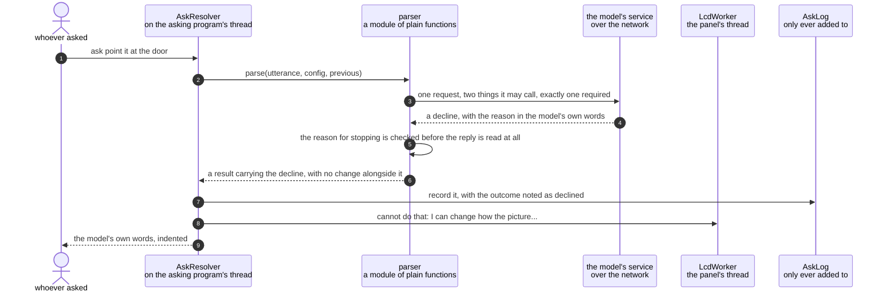

# The language model declines a request it cannot satisfy

**Priority: `LOW`** — it needs the optional path for requests in words[^ask] to be switched on, and it is the outcome nobody designs for first, but it is what stops the camera inventing an answer. [What the priorities mean](../how-to-write-scenario-docs.md).

Typing `ask point it at the door` is a perfectly sensible thing to say to a
camera, and an impossible thing for this one to do. Nothing among its settings
moves a lens.

The failure worth preventing here is not a crash. It is the model quietly
picking the nearest setting it *can* change, so that the picture turns green and
nobody ever learns that the request was not understood at all. A wrong answer
delivered confidently is worse than no answer, because there is nothing to
notice.

**So declining is treated as a proper answer with its own name.** The model is
given [two things it may call](../../src/language/parser.py#L204) and told it
must call exactly one of them: one to change a setting, and one to explain why
it will not. It cannot reply with ordinary prose, because a third kind of
output would be one that nothing further along knows how to handle.

**A decline is not a failure**, and it deliberately travels a different path
from [a request that goes
wrong](a-model-parse-fails-and-the-panel-says-which-kind-of-failure-it-was.md).
Nothing is recorded as an error, the reply carries the model's own words rather
than a summary written here, and the small panel[^panel] shows `cannot do that:`
followed by the reason.

That distinction carries real weight in the log. A decline is evidence that the
system worked exactly as intended. An error is evidence that it did not. Filing
them together would make it impossible to tell afterwards which had been
happening.

| Class | What it represents, and its part in this scenario |
|---|---|
| [`AskResolver`](../../src/language/resolver.py#L33) | The whole path for requests phrased in words. In this scenario it is the **router**. A decline is looked for before a change[^delta] is, and is sent to the panel and back down the connection[^socket] without ever reaching the drawing loop at all |
| [`parser`](../../src/language/parser.py) | A module of plain functions rather than a class. In this scenario it is the **interpreter of the reply**. It turns a decline[^tooluse], and also one particular shape of the change-a-setting reply, into the very same result |
| [`Parsed`](../../src/language/parser.py#L274) | What one request came back as. In this scenario it is the **either-or answer**. Exactly one of "here is a change" and "I decline" is filled in, so no caller anywhere has to guess which of the two happened |

## A request nothing in the settings can honour

```mermaid
sequenceDiagram
    autonumber
    actor Asker as whoever asked
    participant App as AskResolver<br/>on the asking program's thread
    participant Pr as parser<br/>a module of plain functions
    participant API as the model's service<br/>over the network
    participant Lcd as LcdWorker<br/>the panel's thread
    participant Log as AskLog<br/>only ever added to

    Asker->>App: ask point it at the door
    App->>Pr: parse(utterance, config, previous)
    Pr->>API: one request, two things it may call, exactly one required
    API-->>Pr: a decline, with the reason in the model's own words
    Pr->>Pr: the reason for stopping is checked before the reply is read at all
    Pr-->>App: a result carrying the decline, with no change alongside it
    App->>Log: record it, with the outcome noted as declined
    App->>Lcd: cannot do that: I can change how the picture...
    App-->>Asker: the model's own words, indented
```

| Step | Message | What is going on |
|---:|---|---|
| 1 | `ask point it at the door` | This has already passed the [table of known phrases](../../src/language/shortcuts.py#L246), which hands back nothing rather than guessing. A table cannot decline gracefully. It can only fail to match, and those are not the same thing |
| 2 | [`parse`](../../src/language/parser.py#L401)`(utterance, config, previous)` | Identical to the path that succeeds. Nothing at this point anticipates a refusal, and nothing needs to |
| 3 | one request, two things it may call, exactly one required | The [list of what may be called](../../src/language/parser.py#L204) is generated from the settings rather than written out by hand, so a newly added setting becomes speakable without anybody editing any instructions. Declining is the second of the two |
| 4 | a decline, with the reason in the model's own words | The reason belongs to the model. Nothing here rewrites it, which makes this the one piece of text ever shown on the panel that this program did not write |
| 5 | the reason for stopping is checked before the reply is read at all | A request that the service [refuses on safety grounds](../../src/language/parser.py#L401) still comes back as an apparently successful reply, but with the content empty or incomplete. Code that reached straight for the first piece of content would fail with a confusing error rather than reporting the real one. That is vanishingly unlikely for camera settings, but it costs one comparison to be safe |
| 6 | a result carrying the decline, with no change alongside it | [Exactly one of the two is filled in](../../src/language/parser.py#L274). Success is defined as there being a change present, so a decline can never be mistaken for a change that happens to be empty |
| 7 | [`record`](../../src/language/resolver.py#L216) it, with the outcome noted as declined | This is not filed as an error. That [outcome field](../../src/language/asklog.py#L90) is what lets somebody reading the log later separate "the model said no" from "the model could not be reached", which look identical from the outside but mean opposite things |
| 8 | `cannot do that: I can change how the picture...` | The prefix is added because the reason on its own reads as a statement about the camera rather than as an answer to a question. The text is wrapped to two lines and cut short with an ellipsis if it runs longer |
| 9 | the model's own words, indented | Indented by two spaces, which is how the command connection marks a line as the substance of an answer rather than an acknowledgement that something was received |

Like every other request phrased in words, all of this runs on the asking
program's own thread. The drawing loop is not a participant, and nothing is ever
placed on its queue, because there is nothing to apply.

## Three shapes of "no", and why one of them is an error

| What comes back | Treated as | Why |
|---|---|---|
| A decline, carrying a reason | a decline | The intended path. The model understood the request and explained why it could not be met |
| A change-a-setting reply carrying only a note about what it [could not do](../../src/language/parser.py#L401) | a decline | Something like "zoom in a bit" on its own: nothing here corresponds to a setting, and the model said so. That is a refusal with a reason wearing a different hat, so it is reported as one rather than as an empty change nobody would ever see |
| A change-a-setting reply with nothing in it at all, and no note | [an error](../../src/language/parser.py#L270) | Deliberately treated as a fault. Dressing a malformed answer up as a polite refusal would hide it from the scoring, and hiding it is exactly how a scoreboard quietly stops measuring anything |

**A note about something unachievable, arriving alongside a real change, is not
a decline at all.** A request such as "make it warmer and play some music"
changes the colour scheme[^scheme] *and* points out that the second half went
nowhere. The change is applied, and the leftover explanation is added to the
note the person sees.

That is precisely the case the third column above is guarding against. A request
can be partly satisfiable, and collapsing partial success into outright refusal
would throw away the half that worked.

## Related scenarios

- [A spoken phrase is turned into a config delta by the language model](a-spoken-phrase-is-turned-into-a-config-delta-by-the-language-model.md)
  — the same request when the answer is a change, and where a note about
  something unachievable turns up attached to one.
- [A model parse fails and the panel says which kind of failure it was](a-model-parse-fails-and-the-panel-says-which-kind-of-failure-it-was.md)
  — the other ending, and the one this document is defined against.
- [A spoken phrase is answered from the shortcut table, with no model call](a-spoken-phrase-is-answered-from-the-shortcut-table-with-no-model-call.md)
  — why the table refuses to guess and passes phrases like this one along.
- [Every ask is recorded with its source, its cost and its elapsed time](every-ask-is-recorded-with-its-source-its-cost-and-its-elapsed-time.md)
  — what a declined record looks like, and why it is not filed as an error.

### Footnotes

[^ask]: An **ask** is a request phrased in ordinary words, such as "make it
    warmer", rather than one that already names a setting and a value. It
    arrives as an [`Ask`](../../src/control/command_server.py#L55), and
    [`AskResolver`](../../src/language/resolver.py#L33) decides whether a table
    of known phrases can answer it or whether a language model has to be asked.

[^panel]: The **SPI panel** is a small screen measuring 2.4 inches across the
    diagonal, 240 dots by 320, using a controller chip called the ILI9341. It is
    connected to the computer by a simple four-wire arrangement called SPI, which
    is a common way of attaching small devices. It is driven entirely by the
    program itself, through [`ILI9341`](../../src/lcd/lcd.py#L47), with no
    separate system driver involved. In the sealed box this program is built
    for, this panel is the only screen there is. One complete picture for it is
    153,600 bytes, which has to be sent in pieces of 4 kilobytes each — see
    [`SPI_CHUNK`](../../src/lcd/lcd.py#L44) — because that is as much as the
    connection will accept at a time.

[^delta]: A **delta** is a plain list of the settings a change intends to alter,
    paired with their new values, such as `{"scheme": "amber"}`, and nothing
    else besides. Every way of asking for a change builds one of these and hands
    it to the configuration. None of them ever sets a setting directly. That is
    what keeps the checking in a single place no matter who did the asking.

[^socket]: A **Unix domain socket** is a connection between two programs on the
    same computer, which appears in the file system as though it were a file. It
    behaves like a network connection, with one program writing and another
    reading, except that no network is involved at any point.
    [`CommandServer`](../../src/control/command_server.py#L80) listens on one of
    these, which is how a shell, a phone or another program can reach a running
    camera without the program ever opening a network port.

[^tooluse]: Instead of replying in ordinary prose, the model is required to
    answer by **calling a tool**: naming one of the descriptions it was given
    and filling in its values. The setting that governs this is arranged so that
    it must call one and may never write a sentence. That is what keeps the
    answer in a shape this program can act on directly, rather than one it would
    have to interpret.

[^scheme]: A **colour scheme** is one of the nine named looks listed in
    [`SCHEMES`](../../src/art/palettes.py#L79). Which one is currently in use is
    part of the program's render configuration, and the knob, a key press or a
    typed command can all change it. The scheme called `grey` is the one the
    program starts with, and it is what the phrase "greyscale mode" refers to:
    characters only, worked out from the brightness part of the picture and
    nothing else. Only the scheme called `live` reads the colour parts, through
    [`colour_grid`](../../src/capture/image_processor.py#L187). The remaining
    seven are tints, such as green phosphor, amber CRT and e-ink on paper. A
    tint recolours the same greyscale picture using two fixed colours, so it
    never looks at the colour parts either.
