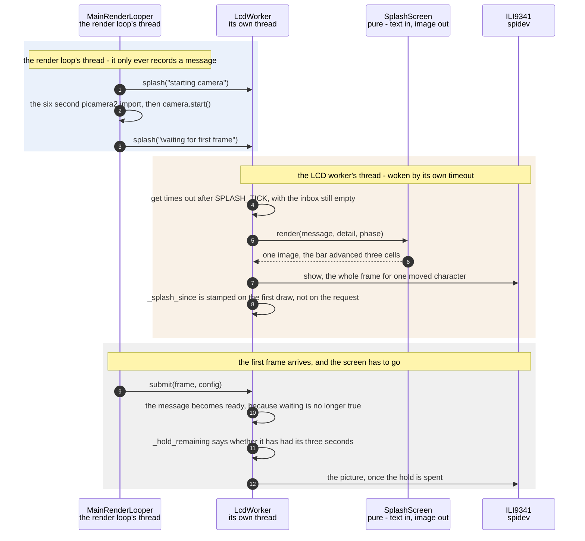

# The SPI panel shows a start-up screen before the first camera frame

**Priority: `MEDIUM`** — it runs once per boot and never again, but for the first twenty seconds it is the only evidence the machine is working. [What the priorities mean](../how-to-write-scenario-docs.md).

`picamera2`[^picamera2] takes about six seconds to import and libcamera
another fifteen to hand over a first frame. In a sealed box with no keyboard
and no monitor, that is twenty seconds of unlit glass, which is exactly what
broken hardware looks like. The value of this collaboration is that the
panel[^panel] says what is happening instead.

It also has to say it **honestly**, and that turns out to be the hard part.
The message is not a fixed splash: it is replaced as start-up moves on, from
"starting camera" to "waiting for first frame" to "ready". A screen that
claimed to be waiting for a frame after frames had started arriving would be
worse than a blank one, because it would be information that is wrong rather
than information that is missing.

Two properties fall out of drawing it on the panel's own thread. The main
thread can call [`splash`](../../src/lcd/lcd_worker.py#L124) freely while
holding nothing, because that call only records a message — the drawing happens
on the worker's next idle tick. And the tick is faster while the screen is up,
0.1 s against 0.2 s, because the sweeping bar is animated by that same tick and
a slower one would take over seven seconds to cross.

*Three ticks of the same screen, which is all there is to it: a message that is
replaced as start-up moves on, and a comet that moves far enough between frames
to read as travelling. The bar is a liveness indicator and deliberately not a
progress bar — nothing at this point knows how long the camera will take.*

Kept by hand: edit [`splash-sweep.svg`](../images/splash-sweep.svg) directly,
since nothing regenerates it.

| Class | What it represents, and its part in this scenario |
|---|---|
| [`LcdWorker`](../../src/lcd/lcd_worker.py#L61) | The panel's own thread. Here it is the **clock and the arbiter**: [`_tick_splash`](../../src/lcd/lcd_worker.py#L321) advances the animation on the idle timeout, and it is what decides the screen has been owed its time and may go |
| [`SplashScreen`](../../src/lcd/lcd_splash.py#L55) | The start-up screen[^splash] as a picture. Here it is the **renderer**, and a pure one: [`render`](../../src/lcd/lcd_splash.py#L135) takes a message, a detail line and a phase number, and returns an image — it knows nothing about panels or threads |
| [`ILI9341`](../../src/lcd/lcd.py#L47) | The panel over SPI. Here it is the **sink**, and it takes a whole frame however little of it changed: one advancing character on the bar costs the same 153,600 bytes a picture does |

## Twenty seconds of saying so

| Step | Message | What is going on |
|---:|---|---|
| 1 | [`splash`](../../src/lcd/lcd_worker.py#L124)`("starting camera")` | Records a message and returns. Nothing is drawn here, which is what makes it safe to call from a thread that does not own the panel — and why a message replaced within 200 ms is simply never seen |
| 2 | the six second picamera2 import, then camera.start() | The reason any of this exists. The import alone is the largest single delay before anything can reach the panel, and it is deliberately not paid at module scope so that the panel can be lit before it |
| 3 | [`splash`](../../src/lcd/lcd_worker.py#L124)`("waiting for first frame")` | The detail line is omitted, which means keep whatever is there — so the caller that knows the grid[^grid] size sets it once and every later message keeps it |
| 4 | get times out after [`SPLASH_TICK`](../../src/lcd/lcd_worker.py#L44), with the inbox still empty | 0.1 s rather than the 0.2 s used later. The tick is the animation's frame rate as well as a poll interval: at the idle rate a full sweep would take over seven seconds, longer than the screen is ever up |
| 5 | [`render`](../../src/lcd/lcd_splash.py#L135)`(message, detail, phase)` | A pure function of three arguments. Keeping the picture free of the panel is what lets it be checked without hardware, on a machine where the panel cannot be looked at anyway |
| 6 | one image, the bar advanced three cells | The sweep is a comet of nine characters over a twenty-eight cell bar, moving three cells a tick. It is a *liveness* indicator rather than a progress bar — nothing here knows how long the camera will take, and a bar that implied it did would be a lie |
| 7 | show, the whole frame for one moved character | The panel takes whole frames. Affordable only because nothing else is competing for the bus yet: there are no camera frames to draw |
| 8 | `_splash_since` is stamped on the first draw, not on the request | The hold is owed from when the screen was actually seen. Stamped at the request instead, a screen queued while the panel was still initialising would have its time run out before it appeared |
| 9 | [`submit`](../../src/lcd/lcd_worker.py#L173)`(frame, config)` | The first frame. Its arrival is the event that ends the start-up screen — not a timer, and not the camera reporting itself ready |
| 10 | the message becomes ready, because waiting is no longer true | Frames are arriving, so "waiting for first frame" has stopped being true and would otherwise stay on the glass for the rest of the hold. Correcting it costs one repaint and buys a screen that is not lying |
| 11 | [`_hold_remaining`](../../src/lcd/lcd_worker.py#L312) says whether it has had its three seconds | A minimum, so the sequence cannot flash past unread on a fast boot. It returns zero when the screen was never drawn at all — usually because the panel failed — since owing time to something that cannot use it would stall the picture for ever |
| 12 | the picture, once the hold is spent | The first real frame. From here the idle tick drops to 0.2 s and the screen is never built again |

The boundary is crossed twice and in one direction only: the loop leaves
messages, and the worker draws them. Nothing in the start-up sequence waits on
anything — which matters most at exactly the moment the camera is taking twenty
seconds to answer.

## Related scenarios

- [A frame reaches the SPI panel without stalling the render loop](a-frame-reaches-the-spi-panel-without-stalling-the-render-loop.md)
  — the ordinary path, and the idle timeout this scenario borrows.
- [A camera that stopped delivering frames is detected and announced](a-camera-that-stopped-delivering-frames-is-detected-and-announced.md)
  — the other thing that idle tick exists for, and the case where frames stop
  rather than start.
- [The character grid is packed into RGB565 pixels for the ILI9341](the-character-grid-is-packed-into-rgb565-pixels-for-the-ili9341.md)
  — how a picture reaches the same panel once there is one.
- [A failure notice is painted over the picture on the SPI panel](a-failure-notice-is-painted-over-the-picture-on-the-spi-panel.md) — the band,
  which shares the frame buffer this screen writes to.

### Footnotes

[^picamera2]: The Python library for the Pi's camera stack, with **libcamera**
    — the Linux camera framework it drives — underneath it. It owns the sensor,
    the ISP configuration and the buffers the app reads from, and it is the
    successor to the older `picamera`.

[^panel]: The **SPI panel** is a 2.4 inch ILI9341 LCD, 240x320, wired to the
    Pi's SPI bus — a four-wire serial bus for talking to peripherals — and
    driven from userspace by [`ILI9341`](../../src/lcd/lcd.py#L47) with no
    kernel driver behind it. In the sealed enclosure it is the only display
    there is. One full frame is 153,600 bytes, sent in
    [`SPI_CHUNK`](../../src/lcd/lcd.py#L44) pieces of 4 KB because that is what
    the driver's buffer holds.

[^splash]: The **start-up screen** is what the panel shows before the camera
    has produced anything: a name and a moving bar, drawn by
    [`SplashScreen`](../../src/lcd/lcd_splash.py#L55). It exists because
    libcamera takes about twenty seconds to deliver a first frame, and unlit
    glass for twenty seconds is what broken hardware looks like.

[^grid]: The **character grid** is the picture as this app holds it: `rows` by
    `cols` character **cells** rather than pixels, each cell one character
    chosen from the brightness of the patch of camera frame it covers.
    [`to_grid`](../../src/capture/image_processor.py#L172) is what resizes a
    plane to it. How big it is depends on where the picture is going — 64 by 24
    on the SPI panel at the default font size, and whatever the window holds on
    the HDMI terminal.
