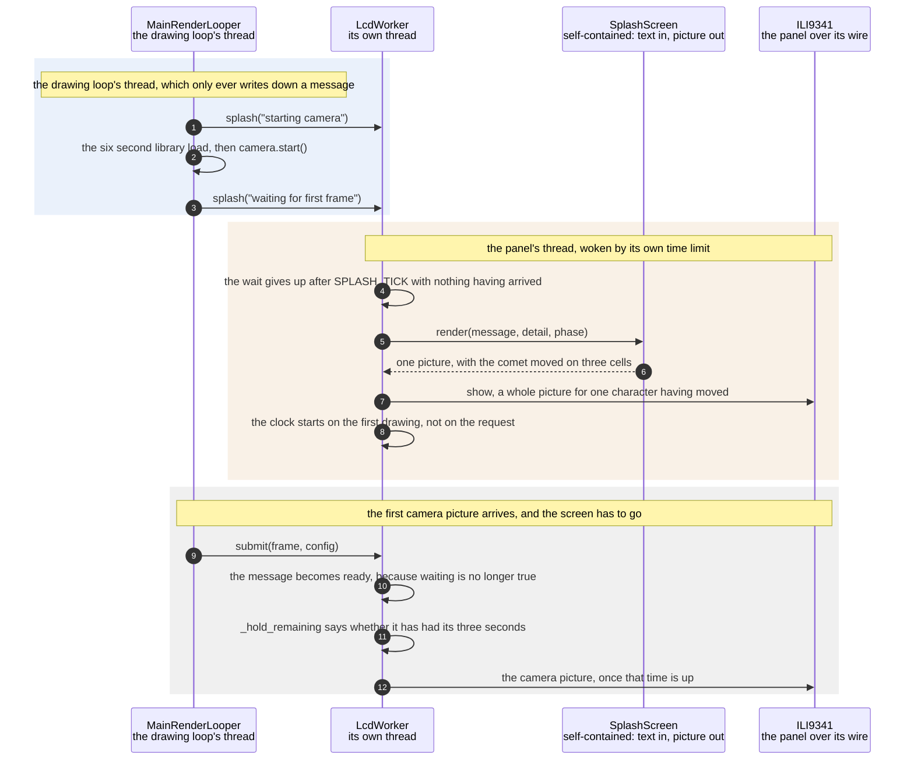

# The SPI panel shows a start-up screen before the first camera frame

**Priority: `MEDIUM`** — it runs once each time the machine starts and never again, but for the first twenty seconds it is the only evidence that anything is working. [What the priorities mean](../how-to-write-scenario-docs.md).

Loading the camera library[^picamera2] takes about six seconds on this
computer, and the camera framework underneath it takes roughly another fifteen
before it hands over a first picture. Added together that is about twenty
seconds. Inside a sealed box with no keyboard and no monitor, twenty seconds of
unlit glass is exactly what broken hardware looks like.

The value of this scenario is that the small panel[^panel] says what is
happening instead of showing nothing.

It also has to say it **honestly**, and that turns out to be the harder part.
The message is not a fixed picture shown throughout. It is replaced as start-up
progresses, from "starting camera" to "waiting for first frame" and finally to
"ready". A screen still claiming to be waiting for a picture after pictures had
begun arriving would be worse than a blank screen, because it would be
information that is wrong rather than information that is simply missing.

Two useful properties follow from drawing the screen on the panel's own thread.

The first is that the main thread can call
[`splash`](../../src/lcd/lcd_worker.py#L124) whenever it likes without holding
anything up, because that call only writes down a message. The drawing happens
later, on the panel thread's next quiet moment.

The second concerns how often that quiet moment comes round. While the start-up
screen is showing, the panel thread wakes every 0.1 seconds rather than the 0.2
it uses afterwards. The reason is that the same wake-up drives the animation.
The moving bar is 28 cells wide and the comet travelling along it is 9
characters long, so a complete journey is 28 plus 9, or 37 positions. The comet
advances 3 positions on every drawing, so a full sweep takes about 12 or 13
drawings. At one drawing every 0.1 seconds that is roughly 1.2 seconds per
sweep, which reads as movement. At the ordinary 0.2 second rate it would take
about 2.5 seconds, which is slow enough to look like something that has stopped.

*Three wake-ups of the same screen, which is the whole of it: a message that is
replaced as start-up moves along, and a comet that travels far enough between
drawings to read as movement rather than as flickering. The bar is a sign of
life and deliberately not a progress bar. Nothing at this stage has any idea how
long the camera is going to take, so a bar that implied it did would be
misleading.*

Kept by hand: edit [`splash-sweep.svg`](../images/splash-sweep.svg) directly,
since nothing regenerates it.

| Class | What it represents, and its part in this scenario |
|---|---|
| [`LcdWorker`](../../src/lcd/lcd_worker.py#L61) | The small panel's own thread. In this scenario it is the **clock and the referee**. [`_tick_splash`](../../src/lcd/lcd_worker.py#L321) moves the animation along whenever the thread wakes with nothing else to do, and it is also what decides that the screen has been given the time it is owed and may now go |
| [`SplashScreen`](../../src/lcd/lcd_splash.py#L55) | The start-up screen[^splash] considered purely as a picture. In this scenario it is the **drawer**, and a completely self-contained one. [`render`](../../src/lcd/lcd_splash.py#L135) takes a message, a second line of detail and a counter, and hands back a picture. It knows nothing whatever about panels or threads |
| [`ILI9341`](../../src/lcd/lcd.py#L47) | The panel itself, over its wire. In this scenario it is the **destination**, and it takes a complete picture however little of it has changed. One character moving along the bar costs the same 153,600 bytes that a full camera picture does |

## Twenty seconds of saying so

```mermaid
sequenceDiagram
    autonumber
    participant App as MainRenderLooper<br/>the drawing loop's thread
    participant W as LcdWorker<br/>its own thread
    participant Sp as SplashScreen<br/>self-contained: text in, picture out
    participant Panel as ILI9341<br/>the panel over its wire

    rect rgba(80, 140, 220, 0.12)
        note over App: the drawing loop's thread, which only ever writes down a message
        App->>W: splash("starting camera")
        App->>App: the six second library load, then camera.start()
        App->>W: splash("waiting for first frame")
    end
    rect rgba(200, 140, 60, 0.12)
        note over W, Panel: the panel's thread, woken by its own time limit
        W->>W: the wait gives up after SPLASH_TICK with nothing having arrived
        W->>Sp: render(message, detail, phase)
        Sp-->>W: one picture, with the comet moved on three cells
        W->>Panel: show, a whole picture for one character having moved
        W->>W: the clock starts on the first drawing, not on the request
    end
    rect rgba(128, 128, 128, 0.12)
        note over App, Panel: the first camera picture arrives, and the screen has to go
        App->>W: submit(frame, config)
        W->>W: the message becomes ready, because waiting is no longer true
        W->>W: _hold_remaining says whether it has had its three seconds
        W->>Panel: the camera picture, once that time is up
    end
```

| Step | Message | What is going on |
|---:|---|---|
| 1 | [`splash`](../../src/lcd/lcd_worker.py#L124)`("starting camera")` | Writes down a message and returns immediately. Nothing is drawn here at all, which is what makes it safe to call from a thread that does not own the panel. It is also why a message replaced within a tenth of a second is simply never seen by anybody |
| 2 | the six second library load, then camera.start() | The reason this whole scenario exists. Loading that one library is the single largest delay before anything can reach the panel, and it is deliberately not loaded when the program first starts up, so that the panel can be lit before the wait begins |
| 3 | [`splash`](../../src/lcd/lcd_worker.py#L124)`("waiting for first frame")` | The second line of detail is left out, which means keep whatever is already there. So the caller that happens to know the grid[^grid] size sets it once, and every later message keeps it without having to repeat it |
| 4 | the wait gives up after [`SPLASH_TICK`](../../src/lcd/lcd_worker.py#L44) with nothing having arrived | That limit is 0.1 seconds, against the 0.2 used once the picture is running. The shorter one is chosen because this wake-up is the animation's heartbeat as well as a way of checking for work, and as set out above the slower rate would make a sweep take about 2.5 seconds instead of 1.2 |
| 5 | [`render`](../../src/lcd/lcd_splash.py#L135)`(message, detail, phase)` | A self-contained calculation from three values. Keeping the picture-making entirely separate from the panel is what allows it to be checked without any hardware, which matters on a machine where nobody can see the panel anyway |
| 6 | one picture, with the comet moved on three cells | The comet is 9 characters long travelling a bar of 28 cells, moving 3 cells each drawing. Three is chosen to be comfortably less than the comet's own length: if it moved further than 9 at a time, successive drawings would not overlap and the comet would read as a blinking smear rather than as something travelling. It is a sign of life rather than a measure of progress, because nothing here knows how long the camera will take |
| 7 | show, a whole picture for one character having moved | The panel accepts nothing smaller than a complete picture. That is affordable only because nothing else wants the wire yet: there are no camera pictures to draw |
| 8 | the clock starts on the first drawing, not on the request | The minimum display time is owed from the moment the screen was actually visible. Timed from the request instead, a screen queued up while the panel was still being initialised could have its time expire before it ever appeared |
| 9 | [`submit`](../../src/lcd/lcd_worker.py#L173)`(frame, config)` | The first camera picture. Its arrival is the event that ends the start-up screen, rather than a timer running out or the camera declaring itself ready |
| 10 | the message becomes ready, because waiting is no longer true | Pictures are now arriving, so "waiting for first frame" has stopped being true and would otherwise remain on the glass for the rest of the minimum display time. Correcting it costs one redraw and buys a screen that is not telling a lie |
| 11 | [`_hold_remaining`](../../src/lcd/lcd_worker.py#L312) says whether it has had its three seconds | A minimum rather than a fixed duration, so that on a fast start the sequence cannot flash past before anybody has read it. Three seconds is long enough to read a short line and see the comet make about two full sweeps. It returns zero when the screen was never actually drawn, which usually means the panel failed, because owing time to something nobody can see would hold up the picture indefinitely |
| 12 | the camera picture, once that time is up | The first real picture. From this point the quiet-moment interval drops to 0.2 seconds and the start-up screen is never built again for the rest of the run |

The boundary between the two threads is crossed twice, and in one direction
only: the drawing loop leaves messages behind, and the panel's thread draws
them. Nothing in the start-up sequence waits for anything, which matters most at
precisely the moment the camera is taking twenty seconds to answer.

## Related scenarios

- [A frame reaches the SPI panel without stalling the render loop](a-frame-reaches-the-spi-panel-without-stalling-the-render-loop.md)
  — the ordinary path, and the source of the quiet-moment interval this
  scenario borrows and shortens.
- [A camera that stopped delivering frames is detected and announced](a-camera-that-stopped-delivering-frames-is-detected-and-announced.md)
  — the other reason that interval exists, covering the case where pictures stop
  rather than start.
- [The character grid is packed into RGB565 pixels for the ILI9341](the-character-grid-is-packed-into-rgb565-pixels-for-the-ili9341.md)
  — how a real picture reaches the same panel once there is one to send.
- [A failure notice is painted over the picture on the SPI panel](a-failure-notice-is-painted-over-the-picture-on-the-spi-panel.md)
  — the band of text, which shares the frame buffer this screen writes into.

### Footnotes

[^picamera2]: **picamera2** is the Python library for the Raspberry Pi's camera,
    built on top of a lower-level piece of software called libcamera. It is the
    replacement for an older library that was simply called picamera. It owns
    the camera sensor, the settings given to the camera hardware, and the memory
    that this loop reads its pictures from.

[^panel]: The **SPI panel** is a small screen measuring 2.4 inches across the
    diagonal, 240 dots by 320, using a controller chip called the ILI9341. It is
    connected to the computer by a simple four-wire arrangement called SPI, which
    is a common way of attaching small devices. It is driven entirely by the
    program itself, through [`ILI9341`](../../src/lcd/lcd.py#L47), with no
    separate system driver involved. In the sealed box this program is built
    for, this panel is the only screen there is. One complete picture for it is
    153,600 bytes, which has to be sent in pieces of 4 kilobytes each — see
    [`SPI_CHUNK`](../../src/lcd/lcd.py#L44) — because that is as much as the
    connection will accept at a time.

[^splash]: The **start-up screen** is what the small panel shows before the
    camera has produced anything at all: the program's name, the grid size, a
    short message and a moving bar. It is drawn by
    [`SplashScreen`](../../src/lcd/lcd_splash.py#L55). It exists because the
    camera framework takes about twenty seconds to deliver a first picture, and
    twenty seconds of unlit glass is what broken hardware looks like.

[^grid]: The **character grid** is how this program holds a picture: as a
    rectangle of character cells rather than of dots. Each cell is one
    character, chosen according to how bright the patch of camera picture behind
    it happens to be. [`to_grid`](../../src/capture/image_processor.py#L172) is
    the code that reduces a picture to that grid. How many cells there are
    depends on where the picture is being sent — 64 across and 24 down on the
    small attached panel at the usual text size, and whatever fits the window
    when the picture goes to an ordinary monitor instead.
