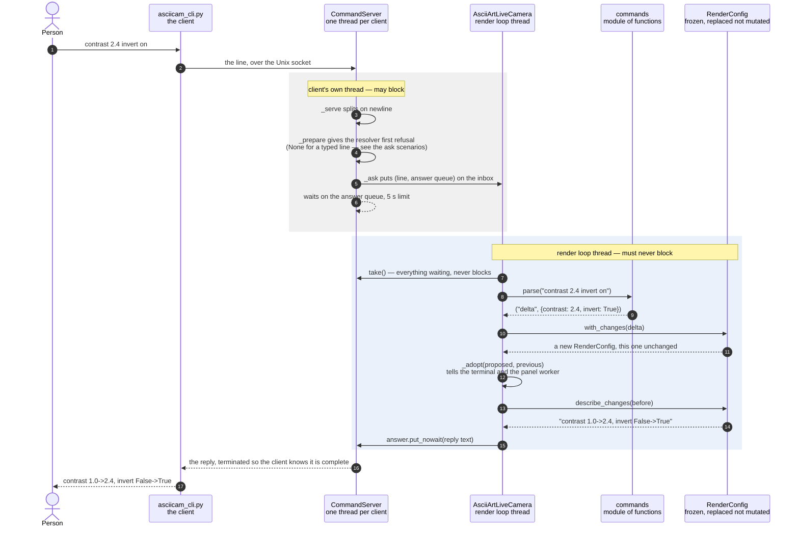

# A typed line becomes a config change

**Classes involved:** `CommandServer` · `commands` (a module of functions, not a
class) · `AsciiArtLiveCamera` · `RenderConfig`

Somebody types `contrast 2.4 invert on` at a shell and the picture changes on
both displays. The value is that this works against a process with no terminal
of its own — the boot service, in the enclosure — where no key can be pressed;
and that it gets there without the render loop ever waiting on whoever typed it.

The collaboration turns on one division. `CommandServer` runs on its own thread
and owns the socket, but it does not understand a single setting: it splits
lines, hands each to the render loop, and blocks its own client for the answer.
`AsciiArtLiveCamera` understands the line but never touches the socket. Between
them is a queue, drained once per frame in the same place keys and the knob are
read — so a typed setting lands exactly where a keypress would, and cannot
arrive halfway through a frame.

The other division is that `commands.parse` turns text into typed values and
stops. It is deliberately forgiving about syntax — `scheme=green` and
`scheme green` both work — and not forgiving at all about names and values,
because deciding what is *allowed* belongs to `RenderConfig` one layer down.
That is why `rotation 45` parses cleanly and is then refused, in the same words
a keypress would have earned. A front end that could accept more than the
validated path would let a phrase work by hand and fail through the parser.

## The sequence

`parse` is where a line stops being text. `_ask` putting the request on the
inbox and `take()` draining it are the same queue seen from its two ends, and
they are why the diagram is drawn in two bands: everything above the handover
may take as long as it likes, and nothing below it may.

This is the accepted path only. When `with_changes` refuses instead of
returning, the collaboration is a different shape and has its own scenario —
see below.

## What each class contributes

### `CommandServer` — accepts typed lines on a Unix socket and queues them
A `threading.Thread` that owns the socket file and a thread per connected
client. It knows nothing about settings; its whole job is to get a line to the
render loop and an answer back, and to never let either side wait for ever.

| Method | In this scenario |
|---|---|
| `_serve(conn)` | Reads from one client, splits on newlines, refuses anything over 4 KB rather than buffering it |
| `_prepare(line)` | Offers the line to the resolver first. A typed line comes back `None` and passes through unchanged; this is the hook the natural-language path uses instead |
| `_ask(line)` | Puts `(line, answer queue)` on the inbox and waits up to 5 s. On a timeout it says the app did not answer, rather than leaving the client looking at nothing |
| `take()` | Everything waiting, as `(line, answer queue)` pairs. **Never blocks** — this is what makes it safe to call from the render loop |

### `commands` — text in, typed values out
A module of functions rather than a class; the only class in it is
`CommandError`, the exception. It is stateless by design, because it holds no
opinion that could disagree with `RenderConfig`.

| Function | In this scenario |
|---|---|
| `parse(line)` | Returns `(kind, payload)` — here `("delta", {...})`. Also recognises `help`, `show` and `reset`. Raises `CommandError` with a message written to be read by whoever typed it |
| `CommandError` | A `ValueError` carrying that message |

### `AsciiArtLiveCamera` — the render loop, and the only way settings change
Owns the config and every device that has to be told when it changes.

| Method | In this scenario |
|---|---|
| `_poll_commands()` | Drains `take()` once per pass and answers **every** line, including ones that changed nothing, so no client is left waiting |
| `_run_command(request)` | One request in, the text to print back out. Dispatches `help`/`show`/`reset`, and hands an ordinary delta to `apply()` |
| `apply(delta, note=False)` | The single way settings ever change. Calls `with_changes`, adopts the result, and returns `True` if the config really changed. `note=False` here because the reply already says what happened, and a status-line notice would say it a second time to somebody looking elsewhere |
| `_adopt(config, previous)` | Pushes the new config to the terminal and the panel worker — the one place that knows what each setting costs to change |

### `RenderConfig` — the complete live render state
A frozen dataclass: it is replaced, never mutated, so "the config" is always one
object and no half-applied state exists.

| Method | In this scenario |
|---|---|
| `with_changes(delta)` | Returns a **new** config, leaving this one alone. Raises `ConfigError` naming *every* unknown field and bad value at once, not the first. Values outside a range are clamped rather than refused |
| `describe_changes(other)` | `"contrast 1.0->2.4, invert False->True"`. Empty when nothing changed, so a caller can use it as the test for whether the change was real |
| `changes_from(other)` | The field names that differ, in `SPECS` order — what `_adopt` iterates |

## Related scenarios

- **Words become a change through the model** — the same diagram with
  `_prepare`'s resolver returning an `Ask` instead of `None`, so the delta is
  worked out on the client's thread and the render loop still only ever applies
  a dict.
- **A keypress becomes a config change** — joins this one at `apply()`, which is
  the point of routing both through it.
- **One change reaches both displays** — takes over at `_adopt`, where this
  scenario stops.
- **A refused change is refused in one place** — what happens in place of the
  `_adopt` and `describe_changes` exchange when a name or value is rejected.
  Same cast, same reply channel, different outcome, which is why it is drawn
  separately rather than as a branch here.

*(Links go in as those documents are written; none exist yet.)*
