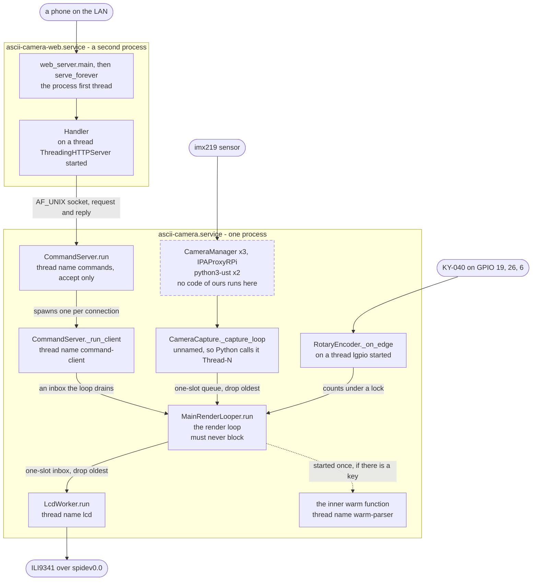

## Threads, processes and what they own

In the enclosure this is **two processes**, not one, and neither can see the
other's memory. The camera process runs sixteen operating-system threads, which
is what `/proc/<pid>/task` reports on a running Pi, and most of them are not
this project's doing at all.

The distinction that matters runs through the whole page, and it is about
**whose code a thread executes**, not about who started it. A thread that
spends any of its life inside this repository is one whose behaviour is written
here and can be reasoned about from here; a thread that never runs a line of it
is furniture. Those two questions do not give the same answer, which is why
they are separated below — the app writes code that runs on a thread `lgpio`
created, and owns not a single line of what libcamera's four threads do.

Almost all of it exists to protect one thread. The render loop must never
block, because everything a person can see stops when it does — so anything
that can take an unknown amount of time is somewhere else, and the boundaries
between here and there are the subject of this page.

### The two processes

| Unit | Runs | Threads |
|---|---|---|
| `ascii-camera.service` | `ascii_camera.py --lcd --encoder --no-terminal` | 16 observed: 6 named by libcamera and its tracing, 10 reporting as `python3` |
| `ascii-camera-web.service` | [`web_server.py`](../../src/control/web_server.py) | 1 idle, plus one per HTTP connection |

They share no memory and import nothing of each other's. The only channel
between them is the Unix socket at `asciicam.sock` — and the interesting
consequence is that a tap on the phone page **creates a thread in the other
process**: [`Forwarder`](../../src/control/web_server.py#L117) opens the
socket, and that connection makes
[`CommandServer`](../../src/control/command_server.py#L80) spawn a
`command-client` thread to serve it.

### Topology



A **dashed** border marks a thread that never executes a line of this
repository's code. Everything solid runs something written here for at least
part of its life — including lgpio's callback thread and the web server's
connection threads, neither of which the app starts.

Three arrows point *into* the render loop and not one of them is a call it
makes and waits on — everything reaching it is something it collects when it is
ready. The only arrow out of it that carries a frame goes to `LcdWorker`, and
that one cannot block either.

### Threads that run this project's code

Nine, across the two processes. Each spends at least part of its life executing
something written here, so what it does is a question this repository can
answer. **Who starts it is a different question**, and it is in its own column
because it decides something else entirely: the app can only name, daemonise
and join the threads it creates itself.

| Runs | Thread name | Started by | Lives |
|---|---|---|---|
| [`run`](../../ascii_camera.py#L785), the render loop | `MainThread` — a runtime label, see below | nothing | the whole run |
| [`_capture_loop`](../../src/capture/camera.py#L123) | none given, so Python calls it `Thread-N` | [`CameraCapture.start`](../../src/capture/camera.py#L82) | `start()` to `stop()` |
| [`run`](../../src/lcd/lcd_worker.py#L217), draw and push | `lcd` | [`LcdWorker`](../../src/lcd/lcd_worker.py#L61), only with `--lcd` | its `start()` to `stop()` |
| [`run`](../../src/control/command_server.py#L135), an accept loop | `commands` | [`_start_commands`](../../ascii_camera.py#L410) | the whole run |
| [`_run_client`](../../src/control/command_server.py#L168) and the resolver | `command-client` | `CommandServer`, one per connection | one request |
| one `import anthropic` | `warm-parser` | [`AskResolver.warm`](../../src/language/resolver.py#L59), if there is a key | **~13 s, then never again** |
| [`_on_edge`](../../src/control/encoder.py#L220) and [`feed`](../../src/control/encoder.py#L100) | none — not this app's to give | **`lgpio`**, when [`RotaryEncoder`](../../src/control/encoder.py#L123) claims its pins | while the encoder is claimed |
| [`main`](../../src/control/web_server.py#L656), then `serve_forever` | `MainThread` again, in the other process | nothing | the whole run |
| [`Handler`](../../src/control/web_server.py#L512) | `ThreadingHTTPServer`'s own | **`ThreadingHTTPServer`**, the standard library's | one request |

**`MainThread` is not a name from this codebase** — it appears nowhere in
`src/`. Nor does `Thread-N`. Both are what `threading` calls a thread nobody
named: the first is the process's own initial thread, which the kernel supplies
at `exec` and CPython adopts rather than creates, so nothing anywhere can be
said to start it. Only four names in that column were chosen here — `lcd`,
`commands`, `command-client` and `warm-parser`, each passed to
`threading.Thread` — and the last two rows are not this app's to name at all.

None of those names is in the diagram, which labels every thread by **the code
that runs on it**. That is the thing this repository actually decides, and it
is the only label that stays true when Python's own naming does not.

Two rows have a foreign name in the *Started by* column, and they are the
interesting ones. The app writes what runs on lgpio's thread without having
created it, and writes what runs on each connection thread without having
created those either — [`WebServer`](../../src/control/web_server.py#L636) subclasses
`ThreadingHTTPServer` precisely so that the threading is somebody else's
problem. In both cases the code is this
project's and the thread is not, which is why one criterion cannot do the work
of the other.

Everything in the *Started by* column that **is** this repository's is also a
**daemon**, deliberately: a wedged worker cannot keep the process alive after
the loop has stopped, and systemd's `Restart=always` is a better answer to a
stuck thread than a hang is. The two threads the app does not start are not the
app's to make daemons of, and neither is joined on the way out.

### Threads that never run a line of it

Six, and nothing here has any bearing on what they do.

| Thread | Belongs to | What the app does about it |
|---|---|---|
| `CameraManager` ×3, `IPAProxyRPi` | libcamera, reached through `picamera2` | **Nothing.** They appear when the camera is configured and go when it is closed; the only contact is through `picamera2`'s API |
| `python3-ust` ×2 | LTTng userspace tracing, linked into libcamera | **Nothing**, and they do no work here at all. An artefact of how the library was built, not of anything this app asked for |

**The listing cannot draw either line for you, which is why the tables above
do.** Of the sixteen threads in the camera process, six announce themselves by
name — and those six are exactly the ones in this table. The other ten all
report as `python3`, and only four of them can be *accounted for* from outside:
the process's first thread, and the three of this app's that are alive at a
quiet moment, once `warm-parser` has exited and with no client connected. The
remaining six are lgpio's and libcamera's own Python-side threads, and nothing
in `/proc` says which is which.

### When each is running

```
seconds                                 0    5    10   15   20   25   30   35   40   45
                                        |    |    |    |    |    |    |    |    |    |
MainRenderLooper.run, the render loop   #############################################
CommandServer.run, accepting            #############################################
RotaryEncoder._on_edge, knob claimed    #############################################
LcdWorker.run, splash then frames       #############################################
picamera2 import                        ######                                       
CameraCapture._capture_loop                   #######################################
start-up screen on the glass             #####                                       
the warm-parser import                  #############                                
CommandServer._run_client, one request                        ###                    
```

Times are from the log of one real start; the two imports are what the whole
start-up sequence is arranged around. `picamera2` costs about six seconds and
nothing can be captured until it is done, which is precisely why the panel is
given something to show at one second rather than at six. The `command-client`
bar is drawn once for illustration — in a real run there are as many as there
are requests, and none at all if nobody asks for anything.

Drawn as characters rather than as a Mermaid `gantt` on purpose: with
`dateFormat X`, Mermaid silently ignores an absolute start date and draws the
bar from zero, so `CameraCapture._capture_loop` claimed to begin at boot. Only positioning
by `after <id>` honours a start, and faking these nine rows that way would need
invisible spacer tasks. A picture that is quietly wrong about which thread
starts when is worse than no picture.

`warm-parser` is the odd one: it is started only when there **is** an API key,
because without one an eleven-second import buys nothing but resident memory on
a 416 MB machine. It runs once and is gone before most people have looked at
the panel.

### The four hand-offs

Nothing crosses a thread boundary in this app except through one of these, and
each has a different discipline because each is protecting something different.

| From | To | Mechanism | Discipline |
|---|---|---|---|
| the capture thread | the render loop | `Queue(maxsize=1)` | **Drop oldest.** The producer evicts before it puts, so the loop gets the newest frame rather than the next in a line |
| the render loop | `LcdWorker.run` | `Queue(maxsize=1)` | **Drop oldest**, counted in `dropped`. [`submit`](../../src/lcd/lcd_worker.py#L173) never blocks and never raises |
| lgpio's thread | the render loop | an integer under a `Lock` | **Accumulate.** Only counts survive between frames, never the order events happened in — so a turn and a press in one frame gap cannot be told apart, and the press wins |
| a `command-client` | the render loop | an inbox the loop drains | **Request and reply.** The client thread waits for its answer; the loop never waits for the client |

The one direction that is *not* a hand-off is the notice: a slow `ask` calls
`_note` from the `command-client` thread, which rebinds one tuple the loop
reads on its next pass and hands the same text to `LcdWorker`, whose `notice`
takes a lock and records rather than draws. Nothing is drawn from that thread
and nothing waits on the loop.

### Shutting down

[`_shut_down`](../../ascii_camera.py#L764) releases in a fixed order — camera,
panel, encoder, socket — and the order is the point rather than a detail. Every
one of those is a **claim** on something the next run will need: the camera
device, the panel's GPIO, the encoder's pins, the socket file. A claim left
behind makes the *next* start fail, which is a worse failure than whatever
caused this one to stop.

`SIGTERM` is what `systemctl stop` sends and what the app installs a handler
for, so the clean path is the ordinary one: the loop's `is_running` goes false,
and every thread above is joined or abandoned as a daemon. The service unit
allows fifteen seconds for it.

### Seeing it for yourself

```bash
pid=$(systemctl show -p MainPID --value ascii-camera.service)
for t in /proc/$pid/task/*; do echo "$(basename $t) $(cat $t/comm)"; done
```

The Python threads all report as `python3` — the names the app gives them are
visible to `threading.enumerate()` but are not pushed down to the kernel on
this Python. What the listing does show, neatly, is the second table: **every
thread with a distinctive name is one that never runs a line of this project's
code.** `CameraManager`, `IPAProxyRPi` and `python3-ust` announce themselves
because libcamera named them; everything with this project's code on it is
anonymous, including the thread `lgpio` started to carry it.
