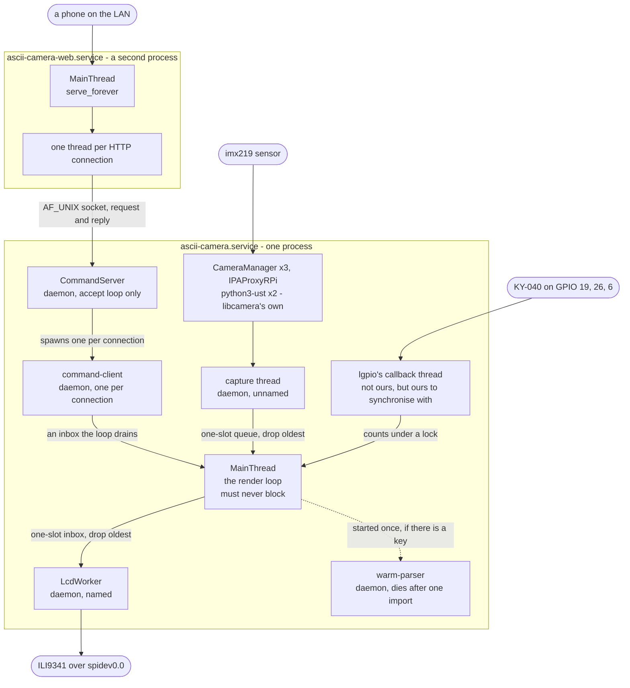

## Threads, processes and what they own

In the enclosure this is **two processes**, not one, and neither can see the
other's memory. Inside the camera process are six threads the app creates, one
it does not create but must synchronise with, and six more belonging to
libcamera. That is sixteen operating-system threads, which is what
`/proc/<pid>/task` reports on a running Pi.

Almost all of it exists to protect one thread. The render loop must never
block, because everything a person can see stops when it does — so anything
that can take an unknown amount of time is somewhere else, and the boundaries
between here and there are the subject of this page.

### The two processes

| Unit | Runs | Threads |
|---|---|---|
| `ascii-camera.service` | `ascii_camera.py --lcd --encoder --no-terminal` | 16 observed: 6 the app makes, 1 lgpio's, 6 libcamera's, and the main one |
| `ascii-camera-web.service` | [`web_server.py`](../../src/control/web_server.py) | 1 idle, plus one per HTTP connection |

They share no memory and import nothing of each other's. The only channel
between them is the Unix socket at `asciicam.sock` — and the interesting
consequence is that a tap on the phone page **creates a thread in the other
process**: [`Forwarder`](../../src/control/web_server.py#L117) opens the
socket, and that connection makes
[`CommandServer`](../../src/control/command_server.py#L80) spawn a
`command-client` thread to serve it.

### Topology



Read the arrows into `MainThread` as the whole of the design: four of them, and
not one is a call the loop makes and waits on. Everything reaching it is
something it collects when it is ready.

### The threads themselves

| Thread | Created by | Lives | Why it is not the render loop |
|---|---|---|---|
| `MainThread` | the interpreter | the whole run | It **is** the render loop — [`run`](../../ascii_camera.py#L785) — and the only thread a setting may be changed on |
| capture thread | [`CameraCapture.start`](../../src/capture/camera.py#L82) | `start()` to `stop()` | The sensor's timing must not depend on how expensive the current scheme is |
| `LcdWorker` | [`LcdWorker`](../../src/lcd/lcd_worker.py#L61), only with `--lcd` | its `start()` to `stop()` | A panel frame is 33 ms of SPI. Inside the loop that would drag the terminal down to the panel's rate |
| `CommandServer` | [`CommandServer`](../../src/control/command_server.py#L80) | the whole run | Accepting a connection is a blocking call, and the loop cannot make one |
| `command-client` | `CommandServer`, **one per connection** | one request | Where a slow `ask` actually runs — two to four seconds against a model, on a thread nothing is waiting on |
| `warm-parser` | [`AskResolver.warm`](../../src/language/resolver.py#L59), if there is a key | **~13 s, then never again** | `import anthropic` costs about eleven seconds on this Pi. It exists solely to spend that before anybody asks |
| lgpio's callback | `lgpio`, inside [`RotaryEncoder`](../../src/control/encoder.py#L123) | while the encoder is claimed | Edges arrive when the knob turns, not when the loop is ready for them |

Every one the app creates is a **daemon** thread. That is deliberate: a wedged
worker cannot keep the process alive after the loop has stopped, and systemd's
`Restart=always` is a better answer to a stuck thread than a hang is.

### When each is running

```
seconds                        0    5    10   15   20   25   30   35   40   45
                               |    |    |    |    |    |    |    |    |    |
MainThread, the render loop    #############################################
CommandServer, accepting       #############################################
lgpio callbacks, knob claimed  #############################################
LcdWorker, splash then frames  #############################################
picamera2 import               ######                                       
capture thread                       #######################################
start-up screen on the glass    #####                                       
warm-parser, one import        #############                                
command-client, one request                          ###                    
```

Times are from the log of one real start; the two imports are what the whole
start-up sequence is arranged around. `picamera2` costs about six seconds and
nothing can be captured until it is done, which is precisely why the panel is
given something to show at one second rather than at six. The `command-client`
bar is drawn once for illustration — in a real run there are as many as there
are requests, and none at all if nobody asks for anything.

Drawn as characters rather than as a Mermaid `gantt` on purpose: with
`dateFormat X`, Mermaid silently ignores an absolute start date and draws the
bar from zero, so `capture thread` claimed to begin at boot. Only positioning
by `after <id>` honours a start, and faking these nine rows that way would need
invisible spacer tasks. A picture that is quietly wrong about which thread
starts when is worse than no picture.

`warm-parser` is the odd one: it is started only when there **is** an API key,
because without one an eleven-second import buys nothing but resident memory on
a 416 MB machine. It runs once and is gone before most people have looked at
the panel.

### The four hand-offs

Nothing crosses a thread boundary in this app except through one of these, and
each has a different discipline because each is protecting something different.

| From | To | Mechanism | Discipline |
|---|---|---|---|
| capture thread | `MainThread` | `Queue(maxsize=1)` | **Drop oldest.** The producer evicts before it puts, so the loop gets the newest frame rather than the next in a line |
| `MainThread` | `LcdWorker` | `Queue(maxsize=1)` | **Drop oldest**, counted in `dropped`. [`submit`](../../src/lcd/lcd_worker.py#L173) never blocks and never raises |
| lgpio's thread | `MainThread` | an integer under a `Lock` | **Accumulate.** Only counts survive between frames, never the order events happened in — so a turn and a press in one frame gap cannot be told apart, and the press wins |
| `command-client` | `MainThread` | an inbox the loop drains | **Request and reply.** The client thread waits for its answer; the loop never waits for the client |

The one direction that is *not* a hand-off is the notice: a slow `ask` calls
`_note` from the `command-client` thread, which rebinds one tuple the loop
reads on its next pass and hands the same text to `LcdWorker`, whose `notice`
takes a lock and records rather than draws. Nothing is drawn from that thread
and nothing waits on the loop.

### Shutting down

[`_shut_down`](../../ascii_camera.py#L764) releases in a fixed order — camera,
panel, encoder, socket — and the order is the point rather than a detail. Every
one of those is a **claim** on something the next run will need: the camera
device, the panel's GPIO, the encoder's pins, the socket file. A claim left
behind makes the *next* start fail, which is a worse failure than whatever
caused this one to stop.

`SIGTERM` is what `systemctl stop` sends and what the app installs a handler
for, so the clean path is the ordinary one: the loop's `is_running` goes false,
and every thread above is joined or abandoned as a daemon. The service unit
allows fifteen seconds for it.

### Seeing it for yourself

```bash
pid=$(systemctl show -p MainPID --value ascii-camera.service)
for t in /proc/$pid/task/*; do echo "$(basename $t) $(cat $t/comm)"; done
```

The Python threads all report as `python3` — the names the app gives them are
visible to `threading.enumerate()` but are not pushed down to the kernel on
this Python — so the ones that stand out by name (`CameraManager`,
`IPAProxyRPi`, `python3-ust`) are precisely the ones the app did not create.
